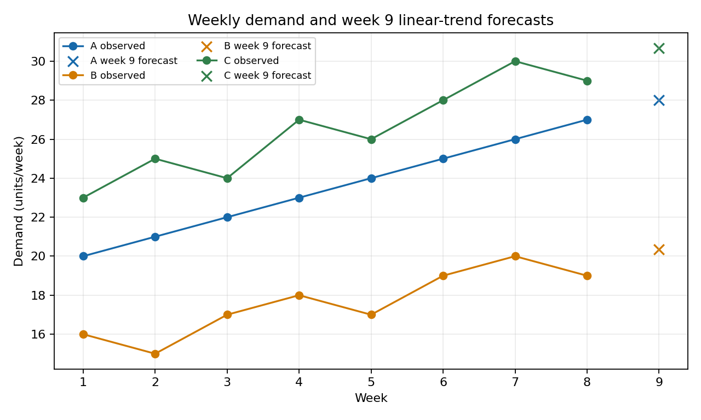

# Offline demand forecasting and allocation exercise

## Problem and data

This self-created practice case asks for week 9 demand at stations A, B, and C based on observed weeks 1–8, followed by integer allocation under a 60-unit stock limit and station caps (A 30, B 25, C 35). The supplied demand is in units/week. Delivery costs are CNY/unit (A 2, B 1, C 3); unmet forecast penalties are CNY/unit (A 8, B 6, C 10). This is not a real contest problem or submission.

The source JSON was checked for eight ordered weeks, all three station fields, and nonnegative finite numeric demand. Units and allocation terms were read from the supplied problem. The executable also rejects nonnumeric cost fields before solving. Raw input SHA-256 is recorded in `results.json`.

## Forecast and validation

For each station, fit a least-squares linear trend to observed demand against week index and extrapolate one week. This baseline assumes a continuing linear trend and does not model seasonality or forecast uncertainty. It uses only information available through week 8.

| Station | Week 9 forecast (units/week) | Rolling-origin MAE, targets 3–8 (units/week) | Last-value MAE, same targets (units/week) |
|---|---:|---:|---:|
| A | 28.000 | 3.500 | 1.000 |
| B | 20.357 | 3.043 | 1.333 |
| C | 30.679 | 4.315 | 1.667 |

The six-origin expanding-window check refits only on weeks before each target. In this small sample the linear trend has larger MAE than the last-value baseline for all stations. This is descriptive evidence for this history, not a general ranking or a guarantee about week 9.

## Allocation

Minimize delivery cost plus penalty on unmet predicted demand, with integer nonnegative allocations within caps and total allocation at most 60. Exact enumeration gives A=28, B=2, C=30, using all 60 units. The objective is 264.929 CNY: delivery costs are 56, 2, and 90 CNY; unmet forecast penalties are 0, 110.143, and 6.786 CNY, respectively. The sum is 264.929 CNY. Exhaustive enumeration of every cap-bounded integer triple (skipping those over stock) supports optimality only for the supplied deterministic forecast, objective, and constraints.

The plotted observations come directly from the supplied problem JSON; crosses are week 9 trend predictions computed by `solver.py`. The vertical axis is demand in units/week.

## Limits and interpretation

There are only eight weekly observations per station, and no future actual demand is available to test week 9. Costs and penalties are treated as fixed inputs. This result says nothing about leaderboard rank, awards, contest rules, or performance on other problems. A real MathorCup big-data exercise would require checking that edition's official track materials and AI/submission policy before applying this workflow.
