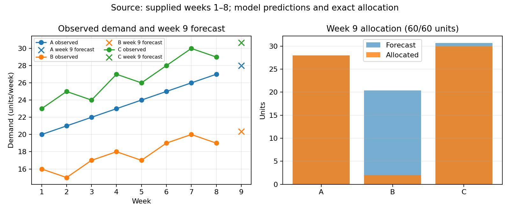

# Week 9 allocation under a short-horizon demand forecast

## Problem and method

The supplied practice instance gives eight weekly demand observations for stations A, B and C, then asks for a week 9 forecast and integer allocation with 60 units of stock. I fit a separate ordinary least-squares line against week number for each station and extrapolate one week. This compact trend model assumes the recent local trend persists for one step; it does not model seasonality or external drivers. Predictions are 28.000 units for A, 20.357 for B and 30.679 for C.

To check forecast behavior without looking ahead, I used expanding chronological origins: for each target week 4–8, fit using only preceding weeks and compare against that week's observed value. Across 15 station-origin predictions, mean absolute error is 0.818 units/week for the trend and 1.333 for a last-observation baseline. By station, trend/baseline MAE is A 0.000/1.000, B 1.097/1.200 and C 1.357/1.800. The result is descriptive for five origins in this small constructed history; the trend gains are not evidence of general predictive superiority.

## Allocation and findings

For integer deliveries x_i, the objective is sum_i(c_i x_i + p_i max(dhat_i - x_i, 0)), using the case's delivery costs and unmet-demand penalties. Constraints are 0 ≤ x_i ≤ cap_i and total delivery ≤ 60. Exhaustively evaluating all feasible triples yields A=28, B=2 and C=30 units. This uses all 60 available units and respects caps 30, 25 and 35. Objective value is 264.929 CNY: A delivery/unmet costs 56/0, B 2/110.143, C 90/6.786. Exhaustive enumeration certifies optimality only for this finite objective, forecast and constraint set. It does not represent realized week 9 demand or any other unprovided delivery costs.

The generated figure is `demand_allocation.png` beside this paper; it plots supplied observations and model outputs in units/week, then predicted demand and selected units. The shortfall at B reflects its lower unmet penalty relative to C and A under the given costs and binding stock limit.

## Limits

This is a self-created offline exercise and not an actual MathorCup submission. Eight weeks and three stations cannot establish rank, awards, full-contest performance, or general superiority of any prompt level. No organizer rules were consulted because no real contest submission is requested. Model identity is requested as gpt-6-luna, but authenticated model, tokens and cost telemetry were unavailable and remain null. Producer checks do not substitute for independent acceptance.

