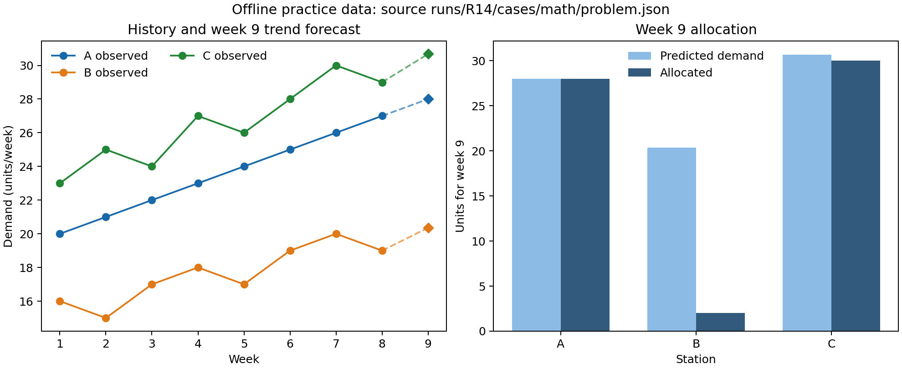

# 短论文：短期需求预测下的限量配送

## 摘要

针对离线练习中 A、B、C 三个配送站的 8 周需求，本文以站点线性趋势预测第 9 周需求，并在总库存 60 units 和站点容量约束下，最小化配送费用与预测缺货惩罚之和。预测值依次为 28.000、20.357、30.679 units/week；对全部 24,076 个可行整数配送向量枚举后，得到 A/B/C 配送 28/2/30 units，目标值约 ¥264.929。四个 expanding-window 折上趋势模型 MAE 为 0.773 units/week，最近值基线为 1.250 units/week。结果仅描述给定短小合成练习，不支持一般预测优势或竞赛结论。

## 问题分析与数据

Q1 是仅利用周 1–8 需求的单步预测；Q2 将预测作为给定输入，在库存、容量和整数约束下做成本决策；Q3 要求将运行、验证和限制可复用地交接。题面提供 8 行完整连续周序、A/B/C 三列，需求单位为 units/week；库存和上限为 units，成本与缺货惩罚为 CNY/unit。没有提供真实第 9 周需求，因此不计算第 9 周预测误差，也不声称方案具有真实运营效果。

## 模型与求解

对站点 `i` 的观测拟合 `y[i,t] = a[i] + b[i]t + ε[i,t]`，使用普通最小二乘，取 `a[i]+9b[i]` 为第 9 周预测。时间验证仅用训练窗口结束前的数据预测下一周：从训练 1–4/目标 5 扩展至训练 1–7/目标 8，共四折；对比基线为上一周观测值。每折都不读取目标周之后数据。

给定预测 `d[i]`，决策变量 `x[i]` 是非负整数配送量，目标为 `Σ_i(c[i]x[i]+p[i]max(d[i]-x[i],0))`，并满足站点上限和 `Σ_i x[i]≤60`。用有限域枚举对每个可行向量直接计算目标，从而避免依赖未说明的求解器状态。A/B/C 的费用分别为 ¥2/1/3 每单位，缺货惩罚为 ¥8/6/10 每单位。

## 结果与检查

模型得到预测 A=28.000、B=20.357、C=30.679 units/week。趋势回测 MAE（A/B/C）为约 0.000/1.121/1.196，平均 0.773；最近值基线 MAE 为 1.000/1.250/1.500，平均 1.250 units/week。折数仅 4 且来自单个短序列，差值可能高度依赖该练习样本，不能外推至真实需求。

穷举给出配送 A=28、B=2、C=30 units，总量 60，不超过各自上限 30/25/35。配送成本为 `28×2+2×1+30×3=¥148`；预测缺货量为 A=0、B≈18.357、C≈0.679 units，按对应惩罚计算约 ¥116.929；目标约 ¥264.929。将公式直接代回结果得到同一值。完整枚举覆盖 24,076 个可行整数三元组，因此在固定预测、题面费用与约束下，该方案是此有限可行域上的全局最优解。该最优性不覆盖预测误差、缺货惩罚设定真实性或库存不确定性。

图中圆点实线是题目给出的第 1–8 周需求，虚线连接第 8 周实际值与拟合外推的第 9 周预测；右图配送柱为实际整数决策。数据来源为 `runs/R14/cases/math/problem.json`，图由 `solve.py` 本次运算生成，单位分别标作 units/week 和 week 9 units。

## 结论与局限

在指定费用和惩罚函数下，枚举结果把供给优先用于单位边际收益较高的站点，并将剩余库存按目标函数分配。趋势法在这四个历史折的平均 MAE 较低，但样本极小，没有不确定区间、季节性或外生因素，也没有第 9 周实测验证。成本和惩罚是题面给定值，未验证其运营依据。练习不含赛事规则、正式题面或参赛评审；不能推断奖项、排名或完整竞赛表现。
