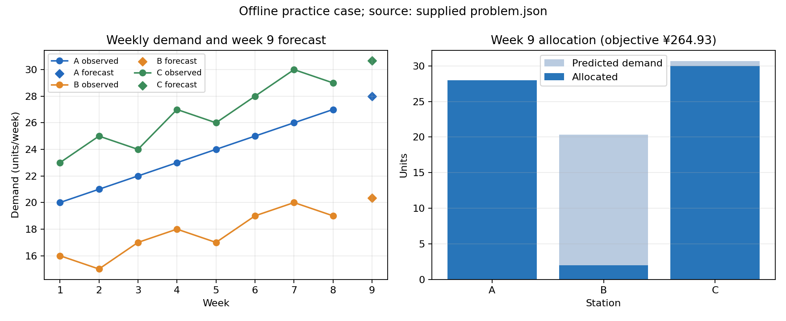

# Short-horizon demand forecasting and integer allocation in an offline practice case

## Problem and data

This self-created offline example asks for week-9 demand forecasts at three community delivery stations and an integer allocation of a fixed stock. It is not a real contest problem or submission. The supplied history contains eight weekly observations for A, B and C (units/week), with 60 available units, station caps of 30, 25 and 35, delivery costs of 2, 1 and 3 CNY/unit, and unmet-prediction penalties of 8, 6 and 10 CNY/unit. The file has eight ordered weeks, all three station columns, no missing values, no duplicate weeks, and numeric finite values. No imputation was used.

## Method

For each station, an ordinary least-squares linear trend over observed week number forecasts week 9. A last-observation forecast is the interpretable baseline. Forecast methods are compared using five expanding-window one-step origins (weeks 4–8); each prediction uses only earlier weeks. This is a small historical diagnostic, not independent future validation. For allocation, integer nonnegative shipments are bounded by station caps and 60 total units. The objective is the supplied sum of delivery cost and penalty times unmet predicted demand. Since the instance is small, every feasible integer allocation is enumerated and the objective is recomputed from its terms.

## Results

The trend forecasts are A 28.000, B 20.357, and C 30.679 units/week. Expanding-window MAE (trend vs last value) is A 0.000 vs 1.000, B 1.097 vs 1.200, and C 1.357 vs 1.800 units/week. A has a perfectly linear supplied history; this explains its zero error on these five origins but does not guarantee future accuracy. The trend has slightly lower observed MAE for B and C on the same five origins, with too little history to claim reliable or general superiority.

The enumerated allocation is A 28, B 2, C 30 units, using all 60 units and remaining within all station caps. Its objective is ¥264.93: delivery costs total ¥148.00; unmet predicted demand is 0.000, 18.357 and 0.679 units for A, B and C, respectively, with a combined unmet penalty of ¥116.93. The objective is exact to the stated model and data; it is not a claim about realized week-9 cost or unmet actual demand.

Figure source is the supplied `problem.json` and computed `results.json`. The left panel plots weeks 1–8 in units/week and the week-9 trend forecasts. The right panel compares predicted demand with integer allocation in units; the title shows the computed objective in CNY.

## Limitations and conclusion

The short series, five validation origins, linear trend assumption and deterministic predicted-demand penalty limit the result. There is no week-9 actual demand to evaluate, no uncertainty model, and no sensitivity study. The allocation is optimal only for the finite stated objective, constraints and predictions. The exercise supplies no basis for claims about current competition rules, awards, rank or contest competitiveness. The code and numerical artifact are `solve.py` and `results.json`; an independent acceptance review remains outstanding.
