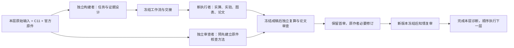

# 本轮实际怎样从少量信息构建工作流

Forge的交付对象是meta-workflow：让接收任务的agent能够设计可执行的分工、证据、决策与验收。C11可分发包只有九份Markdown。数学建模试验中的求解程序、实验和论文是使用该技能形成的任务产物，保存于本轮levels目录。

每层构建者独立读取自身用户原始层级输入、同一C11和同一官方原件，先拆原目标、数据与约束，再设计任务输入输出、方法选择理由、必要证据、失败/歧义分支和后续论文消费关系。产物为workflow/handoff/TODO/来源记录等；设计完成后冻结，不把设计文本算作已求解。四层设计现已实际完成，文件数为7/9/9/7。

另一新上下文执行者接收公开工作流和原件，在分配目录实际分析、编程、求解、验证、制作图表与完整论文。它不能读取前层结果或统一外部评分表；方案和证据要求主要来自原题、用户信息与生成工作流。自检用于发现和修复生产过程中的错误，每次失败和新证据保留。

独立审查者先只读原件及冻结要求建立方法，看到成稿后才进行独立重算、原件重跑、反例、图文与科学论证检查。实际检查不能仅调用作者同一检查器后接受其pass。完整首审冻结，再由原作者知情修订、原审查者知情复审。首次失败与复审结论分别记载。

L1已经真实走到知情复审：初稿16页、初审5pass/1fail，类别身份反例揭示检查器缺陷；原方案经原件绑定独立核查合法。新增修订17页及396文件冻结，668文件知情复审已完成：修订版六项通过，首次失败保留。L1诊断已关闭，L2已交11页论文与2页报告等691冻结文件，独立审查者在19份事前方法冻结后完成350份首审：必需门pass，实验充分性partial；同一原作者现据公开反馈启动知情质量研究；L3–4论文未开始。实际状态以[REPORT](REPORT.md)、[TODO](TODO.md)及checkpoint为准。

论文质量判断依据题意、数学依据、实验/反证、复现与跨产物一致、科学论证和工作流迁移六维，先处理必需错误，再评价证据的充分程度。页数、模型数量、文件数量和作者自检通过率不能替代这些判断；结果不支持虚构竞赛分数或奖项。仅一个历史常规赛题、每层一次生成，能观察本次行为与具体缺陷，尚不足以推断层级因果优劣或十月大数据赛的整体表现。
