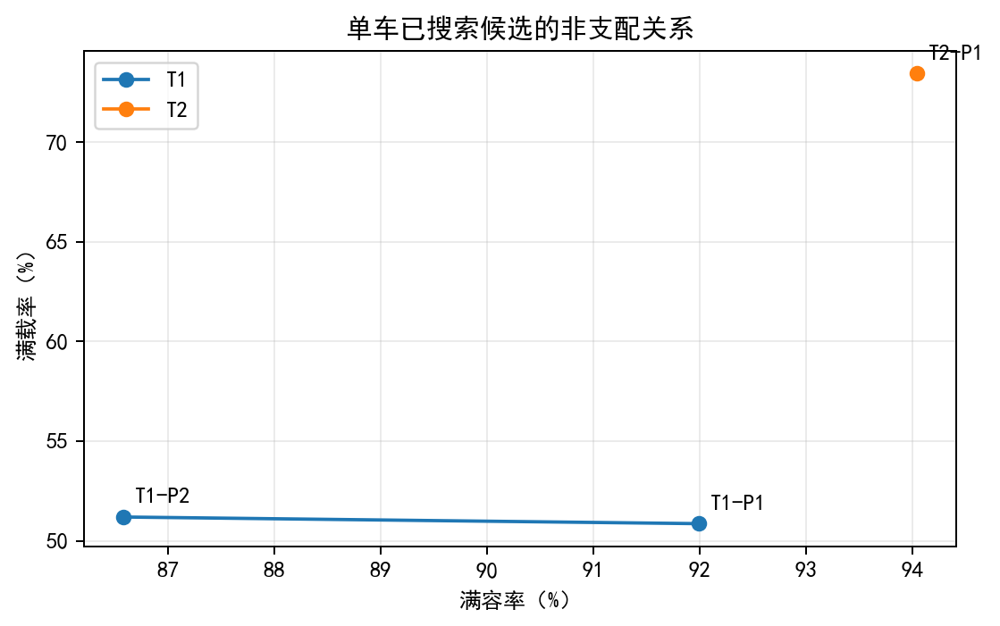
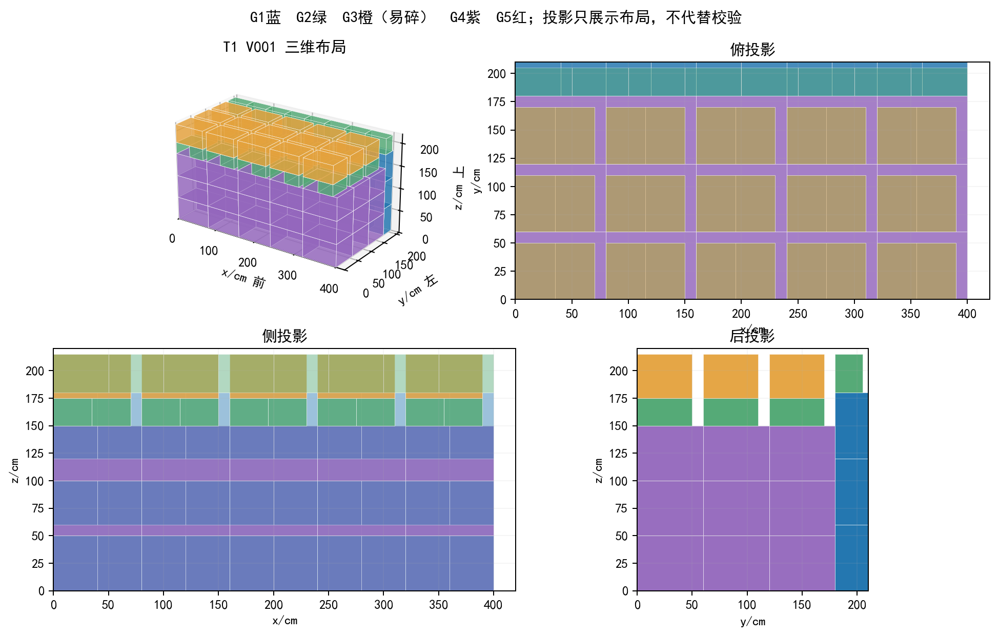
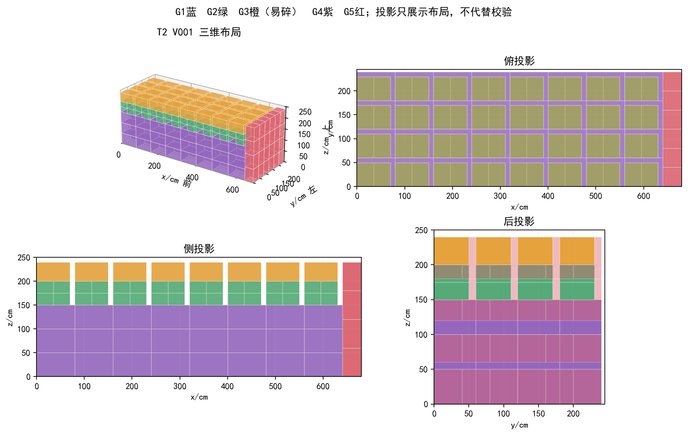
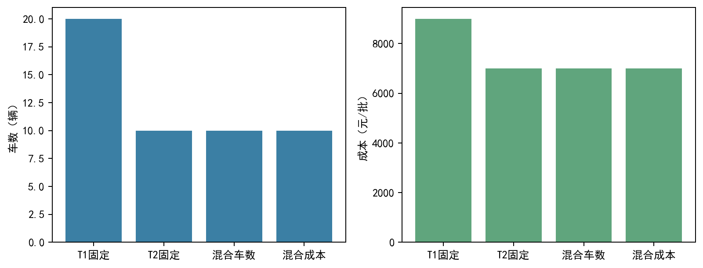
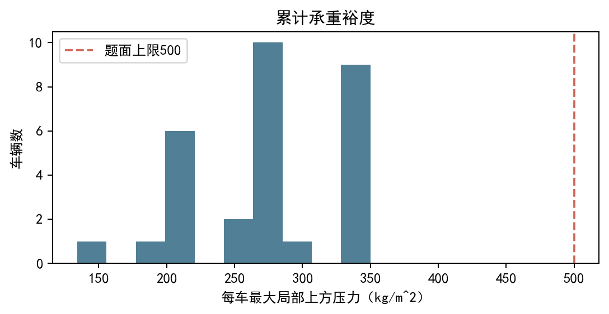
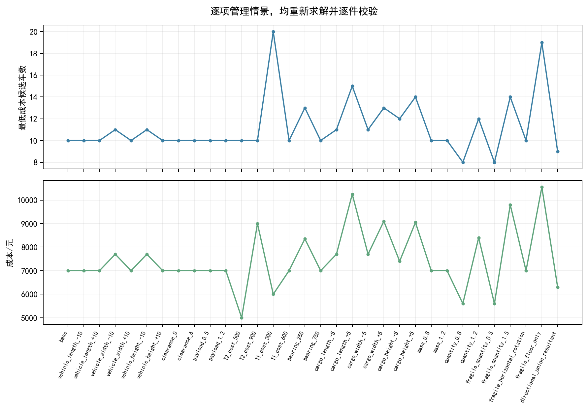

# 全底面支撑与累计传力约束下的多场景三维装箱优化

## 摘要

针对短途运输中的几何、货物类别、姿态、承重与安全间隙约束，本文建立单车双目标与多车整数模式组合模型，设计全底面支撑高度图构造、结构模块修复和整数模式主问题相结合的离线求解方法。以官方附件1的3000件货物为对象，总体积287.35m³、总质量41100kg。单车搜索得到车型1两个非支配候选：满容率91.99%、满载率50.87%，以及满容率86.58%、满载率51.20%；车型2推荐候选为94.04%、73.44%。固定车型完整运输的已获可行方案为车型1 20辆、9000元，车型2 10辆、7000元；最少车与最低费用分别求解后，当前推荐均为10辆车型2、7000元。车队利用率分别为74.04%/34.25%和68.99%/41.10%。所有最终方案交付逐件坐标与姿态，独立实现的几何与传力检查器核算库存守恒、碰撞、共面覆盖、易碎支撑、定向重心与累计承重。体积下界为固定车型1 16辆、车型2及混合车型7辆，成本松弛下界4900元，因此本文给出完整可行决策与差距，不将启发式解称为原题全局最优。参数分析和干净目录复现均依据实算记录，附件2仅进行真实尺寸区间的几何接口验证，缺失业务字段不作虚构补全。

关键词：三维装箱；双目标；全底面支撑；累计承重；高度图；整数模式

## 1 问题重述与研究思路

单车“满容”考察箱体空间使用，单车“满载”考察额定载重使用，两者不应以一个未经说明的权重合并。问题1还要求两种固定车型分别完成整批货物，问题2则允许任意车型组合，并分别追求最少车辆和最低趟费用。问题3要求能被企业管理者使用的技术报告、算法性能与参数影响。运输车辆按一趟一个装载实例计数；没有路线、距离、回程或排放系数，不建立这些额外目标。

这是一类带物理约束的离散三维装箱问题。体积充足不保证能摆放，单车装得最满也不保证重复该装法能运完全部库存。本文先把可行性检查从位置选择中独立出来，再通过构造得到完整上界，最后用有效空间、质量和模式松弛提供下界。论文所有表图来自冻结JSON与CSV，程序不需要联网或商业求解器。

## 2 数据审计与假设

### 2.1 原始资料和单位

PDF共3页，问题与附件1逐源核对；DOCX给出两车型、五货类及约束，XLSX含“箱装产品尺寸”“车型尺寸”和空Sheet3。三份文件SHA256与冻结源定位一致，完整哈希在inputs/source_audit.json。车辆和货物统一以cm、kg、元/趟计量，承重面积换成m²。五种货物数量不缩小、不以采样替代主问题。

| 车型 | 内尺寸/cm | 有效高度/cm | 载重/kg | 趟费用/元 | 原容积/m³ | 可用容积/m³ |
| --- | --- | --- | --- | --- | --- | --- |
| T1 | 420×210×220 | 217 | 6000 | 450 | 19.4040 | 19.1394 |
| T2 | 680×245×250 | 247 | 10000 | 700 | 41.6500 | 41.1502 |

| 货号 | 类别 | 长×宽×高/cm | 单重/kg | 数量/件 | 总体积/m³ | 密度/kg·m⁻³ |
| --- | --- | --- | --- | --- | --- | --- |
| G1 | 标准 | 60×40×30 | 12 | 800 | 57.60 | 166.67 |
| G2 | 标准 | 50×35×25 | 8 | 1000 | 43.75 | 182.86 |
| G3 | 易碎 | 70×50×40 | 15 | 300 | 42.00 | 107.14 |
| G4 | 定向 | 80×60×50 | 25 | 400 | 96.00 | 104.17 |
| G5 | 定向 | 40×40×60 | 18 | 500 | 48.00 | 187.50 |

G5的密度最高，为187.50kg/m³；所有货物的体积加权平均密度约143.03kg/m³。车型额定密度为6000/19.404≈309.21kg/m³和10000/41.65≈240.10kg/m³，均高于本批货物最高密度。因而本题“满容且100%满载”在这些货物类型下不可达，这一数据事实应先于算法目标解释。

### 2.2 可核查的物理解释

（1）车厢原点为右后下角，x沿长向车前，y沿宽向车左，z向上。输出坐标是姿态后长方体的最小坐标角。姿态用原长、宽、高的轴置换和实际dx、dy、dz共同表示。

（2）标准件允许六种正交轴置换，重复尺寸造成的相同几何姿态去重。定向件保持原长宽高。易碎件原题未明确授予任意旋转权限，主方案保持原姿态，另测水平旋转场景。

（3）所有货物采用无悬空、全底面支撑的保守条件。易碎件可在车底，或由多个共面标准件顶面的矩形并集完全覆盖；它不能支撑任何上箱，也不能压在易碎或定向件顶面。易碎件可以处于不同高度，但同一竖直射线不能叠置两个易碎件。“仅地面”作为更严格的情景另测。

（4）对每一实际接触的定向下箱，直接上箱的自身重心投影必须在该下箱闭投影矩形内。多定向支撑的跨箱摆放也执行逐接触检查，边缘接触的重心允许；再核算传给每个下箱的上方子堆合成重心。未提供动态加速度与抗倾覆安全系数，结论仅限静态装载。

（5）每箱自身质量在底面均布，上方的竖直压力在原平面位置向下传递，不人为横向重分配。每一受压区域的上方压力不超过500kg/m²，不包括箱体自身质量；该局部判据强于按接触面积取平均。检查报告同时保留累计上方质量、实际接触并集面积、接触均压、整个顶面均压以及传力合成重心，便于采用不同承重口径复算。

（6）全部箱体顶面不超过车高减3cm。满容率分母仍是原车厢体积，不把安全间隙扣除后的容积偷偷改为分母。主结果不要求两种车型必须同时出现。

新增的全底面支撑、局部压力和保守易碎朝向缩小了搜索与可行模型范围。它们提高静力可解释性，但也可能排除更宽松解释下的可行摆放；因此解的最优性范围需要与这些假设一起阅读。模型定义见model/assumptions.md，原冻结设计文件未改写。

## 3 统一数学模型

### 3.1 符号与决策变量

| 符号 | 含义 | 单位/取值 |
| --- | --- | --- |
| i、g、v | 货物实例、货类、车辆 | 离散索引 |
| q_g、w_i | 库存数量、单重 | 件、kg |
| L_v、B_v、H_v、Q_v | 车长、宽、高、额定载重 | cm、kg |
| a_iv、u_v、t_v | 分配、启用、车型 | 0/1、T1/T2 |
| x_i、y_i、z_i | 姿态后最小坐标角 | cm |
| d_ix、d_iy、d_iz | 姿态后边长 | cm |
| p_i(c)、F_i | 局部上方压力、累计上方质量 | kg/m²、kg |
| r_v、r_w、N、C | 满容率、满载率、车数、成本 | 无量纲、辆、元 |

令a_iv表示货物i是否分配给车辆v，u_v表示车辆是否启用，t_v决定车型；单车问题允许a_i=0留在库存，全批次问题要求每件恰好一次分配。姿态变量在各类允许的轴置换集合中选择，确定d_ix、d_iy、d_iz。支撑接触与压力场是位置和姿态的派生变量。

### 3.2 几何、库存与重量约束

```text
全批次：sum_v a_iv = 1；单车：a_i ∈ {0,1}，每货类不超过库存。
边界：0 <= x_i，x_i+d_ix <= L_v；y、z同理，z_i+d_iz <= H_v-3。
载重：sum_i w_i*a_iv <= Q_v*u_v。
不交叠：同车任意两件在x、y、z中至少一个轴的投影内点不相交。
```

正体积相交被拒绝，共面或棱线接触允许；检查容差为10⁻⁷cm。将同车每件的x、x+dx、y、y+dy端点排序，可划分成互不交叠的平面矩形单元。对每个箱体底面内的单元，其下方最高表面必须与底面共面，这就是精确并集覆盖判据。简单相加支撑面积会把重叠面积计算多次，并遗漏支撑缝隙，本文不采用这种替代。

### 3.3 累计承重与重心

在任一平面单元c内，箱体i受到的上方压力记p_i(c)，自身底面面积为A_i；沿该单元的竖直货物链按自上而下计算：

```text
p_i(c) = sum_{j在i上方且投影覆盖c} w_j/A_j
每个下层箱：max_{c属于其接触区域} p_i(c) <= 500 kg/m²
上方载荷 F_i = sum_c p_i(c)*area(c)
合成重心 X_i = sum_c p_i(c)*area(c)*center_x(c) / F_i
Y_i同理；要求(X_i,Y_i)在下层投影内。
```

全底面覆盖且没有竖直空隙，使每个区域形成连续的非负反力链。每个上箱的均布自重对面积和两个水平坐标的一阶矩积分均为其真实质量与重力矩；原位传力不改变这些量，所以总力和重力矩守恒。局部上方压力不含自身重量，地板不额外套用货物承重限值。多件支撑时，压力按实际交集区域传递，区域不重计。这是一种可行的静态反力构造，而非材料弹性分析或唯一反力解。

若F_i>0，接触均压是F_i除以实际受力接触面积；整顶均压是F_i除以箱体全部顶面面积。局部判据成立时两种均压均不超过500，故所给方案不依赖用较大整顶面积稀释某个局部超载的做法。单箱重心位于投影的局部检查之外，本文同时保留累计子堆的合成重心。

### 3.4 各问题目标与利用率

```text
单车体积率 r_v = sum_i a_i*d_ix*d_iy*d_iz / (L*B*H)
单车载重率 r_w = sum_i a_i*w_i / Q
问题1单车：同时最大化 (r_v,r_w)，输出所搜候选非支配集。
问题1全批次：固定车型，最小化 N = sum_v u_v。
问题2最少车：允许两车型，最小化 N。
问题2成本：另一次求解最小化 C = sum_v c_(t_v)*u_v。
车队 r_v = 总货物体积/所有启用车原容积之和；r_w = 总质量/总额定载重。
```

车队利用率使用比值的总量形式，不能把各车比率直接平均作为不同车型混合后的指标。单车非支配指另一个候选两率都不低且至少一率严格更高时，该候选被剔除。没有证据证明连续三维问题的完整Pareto前沿，本文只给已搜索集合中的非支配解。

## 4 求解算法与程序实现

### 4.1 全支撑高度图构造

原货物尺寸均为5cm的倍数，将车底按5cm网格表示，维护每个单元的当前最高表面、顶面货物类别、累计承重剩余以及定向下箱的投影范围。高度方向直接保留实际cm坐标。对候选货类和每个允许姿态，矩形窗口的最大、最小高度相等才可能全底面共面支撑；对易碎件还要求窗口全为标准顶面或全为地板，对所有上箱都禁止窗口包含易碎顶面。

用一维最小/最大滤波依次沿两轴处理，生成所有网格候选位置。每个候选再检查实际高度、剩余载重、局部传载和逐接触定向重心。选择由高度、位置紧凑度决定的确定性评分最小候选。按准备定向底座、铺标准支撑层、放易碎件、填充其他余量的阶段安排，并比较“低位优先”和“紧凑优先”以及0.65、0.80、1.00倍有效高度的准备阈值。12个策略在两车型上都真实运行。

每辆装完后从库存减去实际已放件，直到库存为零才结束全批次计算；无法放入任何件时明确抛错。由于网格候选和排序是有限构造，这个算法不证明枚举所有三维布局。对同一类型重复件保存唯一实例ID，换姿态后仍是同一件，而不是增加库存。

### 4.2 有针对性的结构模块

严格定向重心约束使某些标准件跨定向底座的摆放被拒，常规高度图的支撑顶面出现碎片。基于这个实测弱点，本文构造底座、标准支撑垫、易碎帽的明确模块，再将模块放在空地板区域，其余空间回到高度图填充。模块仍逐件输出并调用独立检查，不把模块外包络等同于实际装载体积。

例如车型1的G4帽模块在80×60cm底面上堆3件G4，高度150cm；上置2件G2，姿态35×50×25cm，形成70×50cm标准顶面；再放一件G3，高度215cm，满足217cm有效高度。车型2可再加一层G2，把标准顶面升到200cm，易碎顶面为240cm。G5底座和标准垫层利用接触重心位于相邻定向投影公共边界的合法摆放，模块坐标由程序明列。6种模块排序/垫层变体被实际比较，效果既有改善也有变差，未把所有变体包装为单调改进。

### 4.3 几何模式与整数主问题

一辆已校验的完整布局构成模式p，a_gp为该车装载货类g的件数，车型和费用随模式保存。对非负整数使用次数n_p，求解：

```text
sum_p a_gp*n_p = q_g，g=G1,...,G5；n_p为非负整数。
最少车主问题：min sum_p n_p。
成本主问题：min sum_p c_p*n_p。
```

采用等式而非“至少覆盖”，避免随意删除支撑箱造成悬空。模式重复使用时重新实例化唯一货物ID；选择后重新检查整个车队。去除件数组合与车型相同的重复模式后得到99个模式。主问题使用SciPy内置HiGHS的MILP入口，每个主要目标单独求解，限时60秒；将已知可行目标上界加入剪枝，同时保留固定车型方案作为真实incumbent。求解器超时返回的新可行解可能比已有解差，接收器必须取已知候选中的更优者，不能误称“成本最优”。

模式池有限，池内最优也不能推广成原题所有布局最优。模式主问题与原始几何问题的上下界分开陈述。单车双目标搜索还加入按质量密度和体积取向的装载顺序锚点；推荐使用相对已搜索两率理想点的均衡程度，偏好公开而不虚构利润函数。

### 4.4 独立实现的可行性检查器

求解器用网格滤波选择位置，检查器不调用该可行性函数。检查器读导出坐标，先做任意箱对的正体积交叠、边界、姿态、载重和数量核算，再用所有真实平面端点形成的精确矩形分区扫描支撑与竖直压力，检查接触定向下箱重心和累计上方重心。图像不参与可行性判定。检查器独立实现但由本文作者编写和运行，这属于作者自检，不冒充新上下文独立验收。

实际迭代中，检查器发现6件标准件压易碎件的反例：将类别最大值与易碎类别比较，会漏掉易碎/定向混合区域。已改为窗口是否包含易碎件的布尔检查，并重新跑模块。所有失败布局、旧版本和超时incumbent记录保留在logs/iterations.md与results的旧目录，最终表图仅消费通过检查的冻结产物。

## 5 问题1：单车双目标与固定车型整批配送

### 5.1 单车候选与管理推荐

| 车型 | 候选 | G1 | G2 | G3 | G4 | G5 | 质量/kg | 满容率 | 满载率 |
| --- | --- | --- | --- | --- | --- | --- | --- | --- | --- |
| T1 | P1 | 0 | 344 | 20 | 0 | 0 | 3052 | 91.99% | 50.87% |
| T1 | P2 | 0 | 384 | 0 | 0 | 0 | 3072 | 86.58% | 51.20% |
| T2 | P1 | 0 | 0 | 0 | 0 | 408 | 7344 | 94.04% | 73.44% |



车型1 P1用344件G2和20件G3获得91.99%满容率和50.87%满载率；P2用384件G2获得86.58%和51.20%，质量多20kg但体积利用率减少5.41个百分点，二者互不支配。以已搜索理想点(91.99%,51.20%)归一化，两候选较差指标的相对完成度分别约99.35%和94.12%，故推荐P1用于均衡装载；若企业明确仅追求质量，则P2是已搜索质量锚点。车型2 P1装408件G5，94.04%与73.44%均不低于其他已搜索候选，因而只保留这一点。

最高货物密度187.5kg/m³乘以安全间隙后的可用容积，给出车型1满载率不超过59.81%、车型2不超过77.16%的宽松上界。即使空间完全填满也无法达到额定100%载重，推荐者不应把残余载重认作无条件的算法失败。车型2单车点相对该重量上界仍有余量，本文未证明其全局质量最优。

另在上述已校验有限候选池执行ε约束扫描：体积率门槛依次为0、85%、90%、93%、95%，在达到门槛的候选中最大化载重率。车型1门槛85%时选择P2，门槛90%时选择P1，93%与95%没有已搜索候选；车型2在93%门槛仍选择P1，95%没有候选。这些未达到门槛只表示本次搜索缺口，不证明原题不可行。完整扫描见epsilon_scan.json。

### 5.2 全批次结果与下界

| 任务 | 车型1/辆 | 车型2/辆 | 总车数 | 成本/元 | 满容率 | 满载率 |
| --- | --- | --- | --- | --- | --- | --- |
| 问题1：仅车型1 | 20 | 0 | 20 | 9000 | 74.04% | 34.25% |
| 问题1：仅车型2 | 0 | 10 | 10 | 7000 | 68.99% | 41.10% |
| 问题2：最少车 | 0 | 10 | 10 | 7000 | 68.99% | 41.10% |
| 问题2：最低成本 | 0 | 10 | 10 | 7000 | 68.99% | 41.10% |

仅车型1完整运输用20辆，全部800/1000/300/400/500件守恒，9000元；仅车型2用10辆，7000元。在所获候选中车型2减少10辆和2000元，费用下降22.22%。车型1车队两率为74.04%、34.25%，车型2为68.99%、41.10%；这反映货物结构和几何余量，不应与单车挑选库存的最好点直接比较。

```text
车型1可用容积 = 4.20*2.10*2.17 = 19.1394 m³
车型2可用容积 = 6.80*2.45*2.47 = 41.1502 m³
固定车型1下界 = ceil(287.35/19.1394) = 16
固定车型2下界 = ceil(287.35/41.1502) = 7
```

车型1若只用原容积，会错误地得到15辆下界；15辆的有效容积仅287.091m³，小于287.35m³，因此顶部3cm会改变这一整数下界。额定载重下界分别仅为7辆、5辆，不主导。由于任何易碎件上方都不能再有货物，其底面投影互不重叠，300件易碎底面积合计105m²，相应车底面积下界12辆、7辆，也弱于或等于有效体积界。

故车型1真实最少车数位于[16,20]，车型2位于[7,10]；相对于可行上界的最坏相对差距分别为20%和30%。差距明确说明还存在优化空间，而不是把构造结果称为“最少已证明”。

### 5.3 逐车清单与逐件坐标

车型1完整车队如下。

| 车号 | G1 | G2 | G3 | G4 | G5 | 满容率 | 满载率 |
| --- | --- | --- | --- | --- | --- | --- | --- |
| V001 | 30 | 38 | 15 | 45 | 0 | 86.18% | 33.57% |
| V002 | 30 | 38 | 15 | 45 | 0 | 86.18% | 33.57% |
| V003 | 30 | 38 | 15 | 45 | 0 | 86.18% | 33.57% |
| V004 | 30 | 38 | 15 | 45 | 0 | 86.18% | 33.57% |
| V005 | 30 | 38 | 15 | 45 | 0 | 86.18% | 33.57% |
| V006 | 30 | 38 | 15 | 45 | 0 | 86.18% | 33.57% |
| V007 | 30 | 38 | 15 | 45 | 0 | 86.18% | 33.57% |
| V008 | 30 | 38 | 15 | 45 | 0 | 86.18% | 33.57% |
| V009 | 22 | 30 | 15 | 39 | 16 | 81.90% | 33.20% |
| V010 | 20 | 36 | 16 | 0 | 80 | 66.66% | 36.80% |
| V011 | 20 | 36 | 16 | 0 | 80 | 66.66% | 36.80% |
| V012 | 20 | 36 | 16 | 0 | 80 | 66.66% | 36.80% |
| V013 | 20 | 36 | 16 | 0 | 80 | 66.66% | 36.80% |
| V014 | 20 | 36 | 16 | 0 | 80 | 66.66% | 36.80% |
| V015 | 20 | 48 | 16 | 0 | 80 | 69.37% | 38.40% |
| V016 | 0 | 170 | 24 | 0 | 0 | 55.65% | 28.67% |
| V017 | 0 | 144 | 24 | 0 | 0 | 49.78% | 25.20% |
| V018 | 11 | 124 | 21 | 1 | 4 | 50.41% | 25.60% |
| V019 | 245 | 0 | 0 | 0 | 0 | 90.91% | 49.00% |
| V020 | 162 | 0 | 0 | 0 | 0 | 60.11% | 32.40% |

车型2完整车队如下。问题2的两个当前推荐方案与这份车队一致。

| 车号 | G1 | G2 | G3 | G4 | G5 | 满容率 | 满载率 |
| --- | --- | --- | --- | --- | --- | --- | --- |
| V001 | 0 | 128 | 32 | 96 | 24 | 85.05% | 43.36% |
| V002 | 0 | 128 | 32 | 96 | 24 | 85.05% | 43.36% |
| V003 | 0 | 128 | 32 | 96 | 24 | 85.05% | 43.36% |
| V004 | 0 | 128 | 32 | 96 | 24 | 85.05% | 43.36% |
| V005 | 76 | 48 | 24 | 15 | 184 | 77.30% | 53.43% |
| V006 | 96 | 0 | 24 | 0 | 216 | 74.45% | 54.00% |
| V007 | 0 | 256 | 36 | 0 | 4 | 39.91% | 26.60% |
| V008 | 32 | 184 | 36 | 0 | 0 | 36.96% | 23.96% |
| V009 | 380 | 0 | 32 | 0 | 0 | 76.45% | 50.40% |
| V010 | 216 | 0 | 20 | 1 | 0 | 44.64% | 29.17% |

下表展示两个代表车的前5件，坐标和姿态尺寸均为cm；轴置换0、1、2分别指原长、宽、高。

| 车型 | 货物ID | x | y | z | dx | dy | dz | 轴置换 |
| --- | --- | --- | --- | --- | --- | --- | --- | --- |
| T1 | G4-0001 | 0.0 | 0.0 | 0 | 80 | 60 | 50 | [0, 1, 2] |
| T1 | G4-0002 | 0.0 | 0.0 | 50 | 80 | 60 | 50 | [0, 1, 2] |
| T1 | G4-0003 | 0.0 | 0.0 | 100 | 80 | 60 | 50 | [0, 1, 2] |
| T1 | G2-0001 | 0.0 | 0.0 | 150 | 35 | 50 | 25 | [1, 0, 2] |
| T1 | G2-0002 | 35.0 | 0.0 | 150 | 35 | 50 | 25 | [1, 0, 2] |
| T2 | G4-0001 | 0.0 | 0.0 | 0 | 80 | 60 | 50 | [0, 1, 2] |
| T2 | G4-0002 | 0.0 | 0.0 | 50 | 80 | 60 | 50 | [0, 1, 2] |
| T2 | G4-0003 | 0.0 | 0.0 | 100 | 80 | 60 | 50 | [0, 1, 2] |
| T2 | G2-0001 | 0.0 | 0.0 | 150 | 35 | 50 | 25 | [1, 0, 2] |
| T2 | G2-0002 | 35.0 | 0.0 | 150 | 35 | 50 | 25 | [1, 0, 2] |

完整逐件数据共分别3000行，见results/final/fixed_T1_placements.csv、fixed_T2_placements.csv；两个混合目标另有各自完整CSV，单车候选则在single_T1_0.json、single_T1_1.json、single_T2_0.json中。任何逐件方案都包含truck_id、item_id、类型、x/y/z、dx/dy/dz、轴置换和重量，可直接复算。





图中x向前、y向左、z向上与题面原点一致。三维与投影在大量箱体处可能遮挡；方案完整性由逐件文件和检查报告保证，不能从图片数箱来证明。

## 6 问题2：两车型任意组合与独立成本优化

最少车辆和最低费用是两个单独的整数求解任务。原费用下大车型可用空间约为小车型的2.15倍，而趟费用仅为1.56倍，因此其单位可用容积费用更低；这解释已获推荐偏向车型2，但它只是一种经济机制，不能替代几何计算。

本次最少车推荐是0辆车型1＋10辆车型2，总车数10、费用7000元。已证明99模式池中的最少车数为10。成本任务重新求解后，当前最好候选仍为10辆车型2、7000元；已证明当前模式池成本最优。两个目标在当前可行候选中一致，并非算法把成本问题省略；其主问题收据、原始incumbent、时间限与选择记录分别保存在mixed_count.json和mixed_cost.json。

混合车数的通用体积下界为7辆。对于成本，对非负整数n1、n2只保留有效体积、载重和易碎底面积必要条件，求最小450n1＋700n2，得到4900元，由7辆车型2满足松弛条件。几何未被松弛下界证明，所以真实最低费用位于[4900,7000]元，真实最少车位于[7,10]辆。成本上界相对下界的差距为30%（以7000元为分母）。



当两车型费用比变化，车数最少和成本最低可以分离，下一节给出实际情景而非强行宣称原参数必然产生两种车队。企业应先确定主要目标，再使用另一指标在相同主要目标值下择优；直接把车数与费用任意加权会改变题目。

## 7 正确性、性能与复现

### 7.1 实际验证与物理裕度

用附件1各货类3件构成15件真实小链。早期v1小链在后续严格定向重心规则下出现G1-0003与G5-0001接触重心越界，最终依赖核查拒绝了该旧证据；已保留真实失败并以v3重新求解全部15件。最新版小链经历原始读取、摆放、输出、独立校验和0.01cm抬高违规变体拒绝，全部通过当前严格口径。证据为results/smoke_v3.json与review/smoke_v3_check.json，未沿用旧版本通过标签。随后运行15项边界/反例测试，全部得到预期接受或拒绝，包括精确接触可行、0.01cm正交叠拒绝、旋转越界、顶部3cm缺失、超载、重复/漏件、定向错姿态、易碎被压、底面缝隙、不共面支撑、高层累计传载、逐接触重心、超库存及附件2字段缺失。

最终四个全批次任务与三个单车候选均逐件重算，无漏件、重复、越界、正交叠或支撑违反。车型1完整方案最大局部上方压力275kg/m²，车型2为350kg/m²，分别为上限的55%和70%；各车最小顶部间隙不低于3cm。检查器同时保留每个承重箱的接触均压、整顶均压和重心数据，避免只检查直接上件而忽视更高层质量。



通过这些检查仅说明当前静态口径下的输出可行，不证明全局最优、车辆道路动态安全或年度竞赛规则符合性。新的独立审查者可以直接从原件与逐件文件重新检验，本文没有把作者的自检报告当作独立验收结论。

15件小实例可行解为1辆车型1，非空运输车数下界为1、费用下界为最便宜一趟450元，故这条小链的车数和费用达到精确下界。这是有界的小规模参照，不能外推主实例。

### 7.2 算法比较和资源

| 车型 | 方法 | 最少车 | 最多车 | 策略总秒数 | 计时口径 |
| --- | --- | --- | --- | --- | --- |
| T1 | 一般高度图12策略 | 23 | 25 | 82.73 | 时间为求解，不含检查 |
| T1 | 结构模块6策略 | 20 | 22 | 22.16 | 时间含独立检查 |
| T2 | 一般高度图12策略 | 11 | 14 | 160.39 | 时间为求解，不含检查 |
| T2 | 结构模块6策略 | 10 | 11 | 21.60 | 时间含独立检查 |

在相同主数据与约束下，12种一般高度图策略中最好的固定车型结果为23辆和11辆；结构模块候选最好为20辆和10辆，车辆数分别减少13.04%和9.09%。这是有限策略集合的可行解改善，不是相对最优解的改善率。模块自身有20至22辆等波动，说明构造顺序和剩余库存耦合，不能声称算法单调收敛。

计时来自实际perf_counter，均在Windows Python3.12及现有NumPy、SciPy科学库上运行，无GPU、无安装、无外部数据。表中不同阶段计时范围已列出，不能据其秒数直接证明模块更快。随机种子不适用，因为构造是确定性的；12或6个策略不是统计独立重复。峰值内存和provider模型/token/成本未探测，记null，不从文件大小或模型角色名推算。

### 7.3 可复现接口

```text
py -3.12 -X utf8 -B runs/R19/levels/L1/execution/src/reproduce.py
  --out runs/R19/levels/L1/execution/results/reproduction_new
```

在仓库根执行上述一条命令（参数在同一行），从官方原DOCX/XLSX读取，重建已选算法配方、生成七项任务全部坐标、重新核算约束和关键值。输出目录必须不存在或为空，避免覆盖既有证据。此次干净目录复现报告列出七项几何和关键数值均一致；实际耗时16.26秒，非独立验收。完整探索可用solve.py、module_sweep.py模块扫描与finalize.py，敏感性用experiments.py；README给出具体命令和依赖版本。MILP时间限可能使重新搜索的incumbent不同，因此推荐配方的几何确定性复现与搜索质量重试明确区分。

错误输入不会静默归零：货物缺重量/数量/类别或车辆缺载重/趟费用时validate_config抛出明确错误；不可能放入任何件时报告剩余货物并退出。依赖仅为本机已存在库，第三方在同类环境可以直接运行。

## 8 问题3：参数变化及管理技术报告

### 8.1 实验设计

冻结情景均存configs/experiments.json。基线之外，车厢长、宽、高分别±10cm，顶部间隙0与6cm，载重倍率0.5与1.2，车型2费用500/900元，车型1费用300/600元，承重250/750kg/m²；货物各轴尺寸分别±5cm，质量与全部数量倍率0.8/1.2，易碎数量倍率0.5/1.5；另测易碎水平旋转、仅地面易碎和定向支撑合成重心口径。尺寸变化是明确的绝对扰动，数量取合法整数。每一物理场景重新装箱，费用场景复用仍适用的已校验几何模式并重新解两个目标，不把原坐标硬塞进变小车厢。

每个情景采用一般高度图固定策略和结构模块候选；尺寸改变后模块配方不适用时回到通用高度图，严格“仅地面”场景不使用易碎帽模块。模块在低承重或较大重量情景可能被独立检查拒绝，拒绝数量与原因被保留，只从通过的候选选方案。主问题每目标5秒，保留已知可行上界。窗口为预先声明的900秒，若需延长在日志中前瞻性记录，不重置原计时或隐藏未完成行。

全部32个冻结情景已完成。首900秒窗口实际运行923.81秒，最后一个已启动情景完成造成23.81秒超出，该事实保留而未截断；按提前记录的追加最多600秒计划，仅接续剩余两项，实际60.97秒。参数阶段累计实际984.78秒，没有重跑已完成行或重置原窗口计数。

### 8.2 全部已完成情景与实测响应

| 情景 | 最少车/辆 | 该方案成本/元 | 成本候选车数 | 成本/元 | 满容率 | 满载率 | 秒 |
| --- | --- | --- | --- | --- | --- | --- | --- |
| base | 10 | 7000 | 10 | 7000 | 68.99% | 41.10% | 7.57 |
| vehicle_length_-10 | 10 | 7000 | 10 | 7000 | 70.02% | 41.10% | 28.82 |
| vehicle_length_+10 | 10 | 7000 | 10 | 7000 | 67.99% | 41.10% | 37.85 |
| vehicle_width_-10 | 11 | 7700 | 11 | 7700 | 65.39% | 37.36% | 32.60 |
| vehicle_width_+10 | 10 | 7000 | 10 | 7000 | 66.29% | 41.10% | 37.79 |
| vehicle_height_-10 | 11 | 7700 | 11 | 7700 | 65.33% | 37.36% | 29.69 |
| vehicle_height_+10 | 10 | 7000 | 10 | 7000 | 66.34% | 41.10% | 27.65 |
| clearance_0 | 10 | 7000 | 10 | 7000 | 68.99% | 41.10% | 26.70 |
| clearance_6 | 10 | 7000 | 10 | 7000 | 68.99% | 41.10% | 30.80 |
| payload_0.5 | 10 | 7000 | 10 | 7000 | 68.99% | 82.20% | 36.16 |
| payload_1.2 | 10 | 7000 | 10 | 7000 | 68.99% | 34.25% | 30.77 |
| T2_cost_500 | 10 | 5000 | 10 | 5000 | 68.99% | 41.10% | 7.90 |
| T2_cost_900 | 10 | 9000 | 10 | 9000 | 68.99% | 41.10% | 8.04 |
| T1_cost_300 | 10 | 7000 | 20 | 6000 | 74.04% | 34.25% | 8.33 |
| T1_cost_600 | 10 | 7000 | 10 | 7000 | 68.99% | 41.10% | 8.20 |
| bearing_250 | 12 | 8400 | 13 | 8350 | 60.53% | 34.83% | 32.97 |
| bearing_750 | 10 | 7000 | 10 | 7000 | 68.99% | 41.10% | 34.42 |
| cargo_length_-5 | 11 | 7700 | 11 | 7700 | 57.44% | 37.36% | 25.91 |
| cargo_length_+5 | 15 | 10250 | 15 | 10250 | 51.71% | 28.15% | 23.82 |
| cargo_width_-5 | 11 | 7700 | 11 | 7700 | 55.81% | 37.36% | 32.46 |
| cargo_width_+5 | 13 | 9100 | 13 | 9100 | 58.92% | 31.62% | 36.01 |
| cargo_height_-5 | 11 | 7700 | 12 | 7400 | 60.89% | 39.52% | 31.15 |
| cargo_height_+5 | 13 | 9100 | 14 | 9050 | 62.85% | 32.11% | 33.27 |
| mass_0.8 | 10 | 7000 | 10 | 7000 | 68.99% | 32.88% | 44.20 |
| mass_1.2 | 10 | 7000 | 10 | 7000 | 68.99% | 49.32% | 44.78 |
| quantity_0.8 | 8 | 5600 | 8 | 5600 | 68.99% | 41.10% | 36.18 |
| quantity_1.2 | 12 | 8400 | 12 | 8400 | 68.99% | 41.10% | 54.94 |
| fragile_quantity_0.5 | 8 | 5600 | 8 | 5600 | 79.94% | 48.56% | 50.91 |
| fragile_quantity_1.5 | 14 | 9800 | 14 | 9800 | 52.88% | 30.96% | 44.00 |
| fragile_horizontal_rotation | 10 | 7000 | 10 | 7000 | 68.99% | 41.10% | 38.71 |
| fragile_floor_only | 16 | 10950 | 19 | 10550 | 52.57% | 28.15% | 28.21 |
| directional_union_resultant | 9 | 6300 | 9 | 6300 | 76.66% | 45.67% | 32.61 |



车长下、上情景的成本候选分别为10辆/7000元和10辆/7000元。

车宽下、上情景的成本候选分别为11辆/7700元和10辆/7000元。

车高下、上情景的成本候选分别为11辆/7700元和10辆/7000元。

载重下、上情景的成本候选分别为10辆/7000元和10辆/7000元。

承重下、上情景的成本候选分别为13辆/8350元和10辆/7000元。

货物单重下、上情景的成本候选分别为10辆/7000元和10辆/7000元。

货物数量下、上情景的成本候选分别为8辆/5600元和12辆/8400元。

易碎件数量下、上情景的成本候选分别为8辆/5600元和14辆/9800元。

车辆几何影响具有整数阶梯效应：尺寸增加可能没有跨过一个可用箱列或堆叠层的阈值，车数保持原值而满容率分母增大；尺寸减少也可能先失去特定类型一列而多开整辆车。因此不能期待利用率、车数随某个厘米参数平滑变化。增加几何空间不会恶化真实最优目标，但固定启发式排序可能给出不单调结果；表中只有重新搜索后的候选值，未观察到的普遍单调性不被宣称。

货物尺寸变化同时改变总货物体积和对车厢的整除关系，不能只用总体积比例估算成本。重量变动影响满载率和局部传载，而原批次额定载重有较大余量，因此较小重量变化未必改变车数。承重降低则可以直接限制G5等密度较高货物的叠层，具体变化见实测行；宽松到750kg/m²也不保证当前构造会发现更好的几何解。

费用场景只改变模式主问题经济系数，已校验摆放仍有效。车型1费用300元时全小车候选费用为6000元，提供与原7000元全大车不同的可行经济选择；最终场景推荐以表中重新优化结果为准。易碎数量改变不仅改变体积，还改变不可上压的顶面需求与标准件支撑供给关系，因而是库存结构变化；不能把它等同于所有货物数量同比例缩放。

水平旋转、地面限定、定向跨支撑解释的场景是规则歧义的条件比较，不是修改官方主答案。部分底面支撑和材料弹性承载未纳入本模型，其可能带来的车辆改进未被实测，必须列为适用范围限制。参数实验提供当前实例和算法条件下的响应，不能推出全国物流样本的因果效应。

易碎只在地板放置时，成本候选为19辆、10550元，相比主口径10辆、7000元有明显损失；原题允许标准件顶面支撑，因而把易碎默认只放地面会改变决策。定向多支撑改成仅合成反力重心位于各承接区的宽松解释时，得到9辆、6300元。该布局不能作为已满足严格逐接触上箱中心限制的主答案，恰说明此歧义对车辆数和费用有实质影响，企业需确认规则后选择对应条件的方案。

### 8.3 企业实施建议

第一，接单前统一测量箱体外包装、单重、库存和方向标签，保留车厢内净尺寸及顶部安全间隙。先计算有效体积/质量下界与最高货物密度，判断“满载”的目标是否物理可达。本文货物明显偏体积受限，额定载重余量不宜单独作为装车人员考核失败。

第二，本批次可以把10辆车型2、7000元完整方案作为可执行候选，并保留其[7,10]辆与[4900,7000]元的未知最优性区间。若企业愿意投入额外计算，应重点扩展易碎标准支撑模式、跨车交换及尾车消除，先保持逐件物理检查，再寻求少一辆或更低费用的实际布局；不以算法名替代减车证据。

第三，司机和装卸组按车辆ID、货物ID和坐标执行，先装底层定向与标准底座，再放支撑层、最后放对应易碎件，按照实际支撑有向无环图排序。该装载顺序只是几何可执行顺序，未建车门装卸运动碰撞或不同客户卸货先后，若业务有这些条件应新增约束后重算。

第四，调度须把“最少车”和“最低成本”作为不同决策按钮。原趟费用下推荐一致；报价、载重或货物结构变化后应读新的参数情景，重新解两个目标。未知字段不能用0填入，混合车型成本应按每辆450/700元真实趟费用累加，不采用附件2元/1000km直接替代。

第五，装车现场复核关键底座接触、易碎标签、顶部间隙和重箱传载。当前静力方案需要进一步考虑道路振动、固定绳带、材料箱压强、重心高度和制动加速度后才能声明运输动态安全；本文数据没有这些信息，不替企业作此保证。

## 9 附件2：真实接口验证与数据边界

附件2仓测尺寸中有单点和区间，例如1.8L*6长度345-347mm、宽度236-238mm、高度307-320mm。读取仓测上端、转为cm，车辆采用尺寸区间下端，在固定姿态下检查单件与顶部3cm兼容性。保留化验与仓测原值，不用食用油标称升数估质量；车辆部分封闭长方体可做几何接口，栏板、高低板、装饰加号行和空表不进入封闭厢体模型。

真实读取8个产品与8个封闭长方体车型，共64个配对；64个单件几何适配。所有补齐业务字段为null，完整业务求解标记not executable。

产品数量、包装总重、货物类别与姿态规则、车辆额定载重没有完整提供；E列标题为公路单位运输费用元/1000km，含铁路/海路文字，F列部分数字无明确费用口径。没有实际距离和费用定义就不能换算趟费用。故本次64个真实尺寸配对只是数据解析及单件几何适配，不是完整“大规模业务验证”，没有给缺字段补上虚构值。missing_business_fields记录与明确拒绝测试可供后续补数。

## 10 模型评价与结论

本文的优势是把共同物理约束、单车库存选择与多车全数量守恒放在同一接口中，支撑并集和累计承重有可复算数学定义，四个配送任务均有完整逐件方案。结构模块的效果从23/11辆改进到20/10辆，但有限模式和排序仍限制质量。主要结论是可行候选、公开下界与成本比较，不是未经证明的最优宣告。

模型限制包括：全底面与局部压力的保守子空间、静力而非道路动力学、网格候选和模块不完备、成本主问题时间限、缺少装卸路径/卸货次序、附件2业务字段缺失，以及单实例实验不支持普遍最优和统计泛化。程序与数据可由新审查者独立复算；本文尚未取得独立验收，也未核验年度投稿模板、AI使用规则或提交接口，因此交付是完整练习论文与算法附件，未自动提交竞赛。

对已给资料，问题1提供单车双目标候选、两车型全批次方案和指标，问题2分别优化并比较车辆与成本，问题3提供实现、实际性能记录、参数响应和企业执行建议。继续改进的合理方向是基于真实几何反例扩展模式池、设计跨车修复与小规模精确参照；任何新结果都要重新接受全部物理检查，不通过改名、换分母或删失败记录获得更好结论。

## 参考资料

[1] 2026年第十六届MathorCup数学应用挑战赛题目，D题，多场景、多目标货物运输装箱策略优化。原始PDF，3页；题意与要求唯一来源。

[2] 官方附件1.docx。车辆、货物数量、类别、500kg/m²承重和3cm间隙来源。

[3] 官方附件2：验证数据集.xlsx。三个工作表的尺寸、区间和费用口径数据来源。

本文算法和传力解释由以上数据自行推导。离线没有访问外部论文，未编造作者、年份或文献条目。Python、NumPy、SciPy、Matplotlib、ReportLab等实际版本与环境记录见README和inputs/source_audit.json。

## 附录 程序、方案和证据索引

src/normalize.py由原件生成规范数据；src/solve.py为高度图、模块与MILP算法；src/check.py为独立实现检查器；src/boundary_tests.py为15项反例；src/finalize.py接收可行候选；src/experiments.py为冻结参数情景；src/reproduce.py干净目录重建推荐配方；src/make_paper.py从结果生成图表与正文；src/render_paper.py生成可读PDF。results/final保存所有主解、完整CSV及99模式；review保存逐件约束、边界、接收与复现报告；logs保留真实迭代和失败。本文表格和图源不包含旧结果目录的未接受方案。
