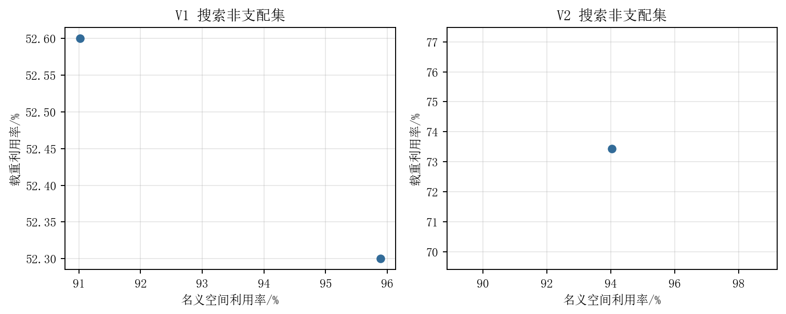
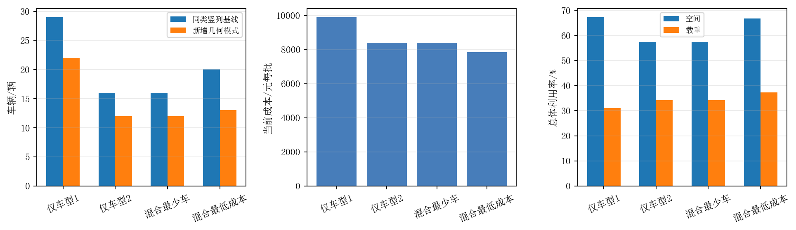
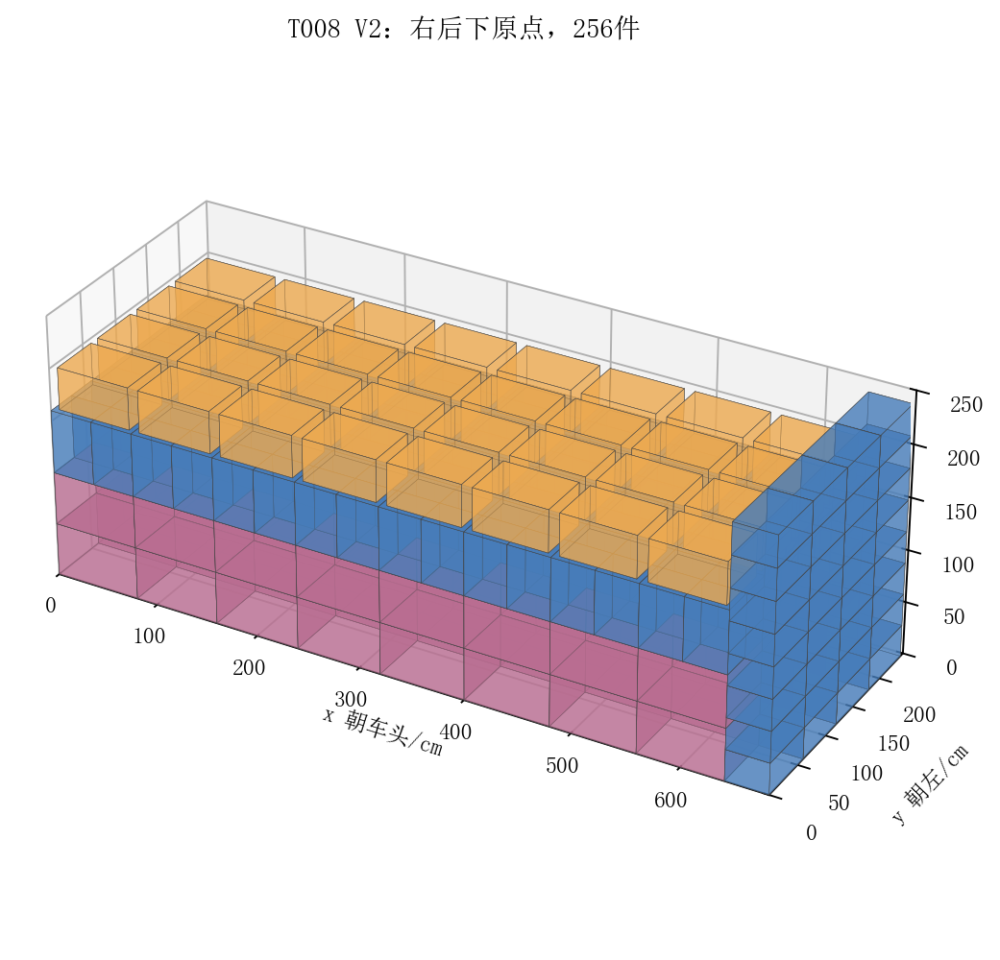
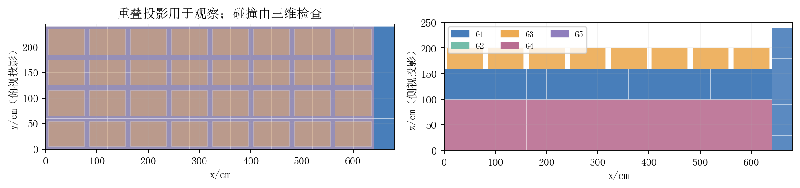
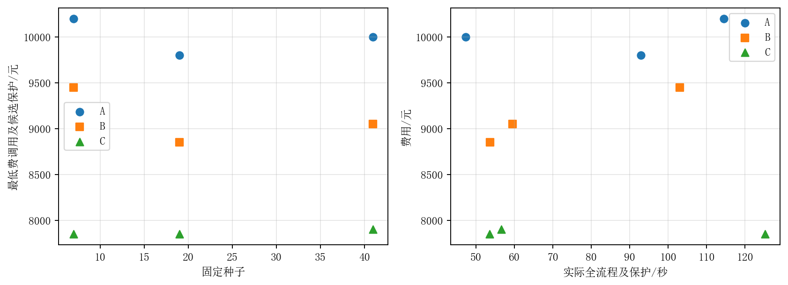
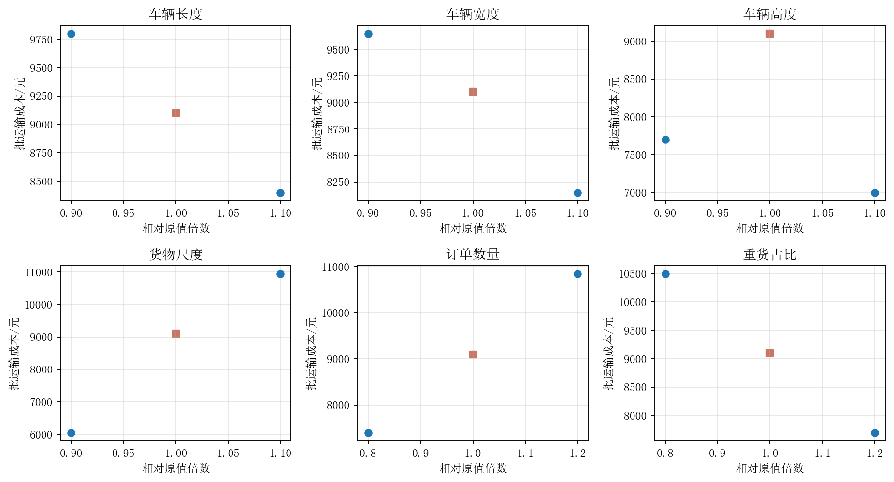
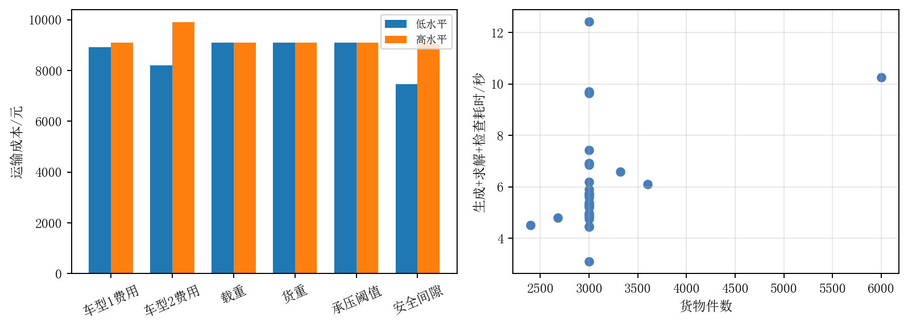

# 满足支撑与累计承载约束的多场景货物装箱：高度量化界与保护块研究

## 摘要

针对附件1的3000件货物，建立统一正交几何、姿态、易碎禁压、定向局部质心及面积比例累计传载模型。初稿已通过独立首审全部必需门，但受限几何库和易碎尾车导致解质量区间较大。本次同一任务知情研究保留原结果，推导不依赖支撑假设的高度量化必要容量界，并以同权重、同种子及同计算上限对照同型柱A、固定标准平台B和新增保护块C。新增块先逐件检查，再生成装载模式，以整数库存等式选择全车队；限时求解保留所有已知合法候选，避免返回较差车队。

总货物287.35m³、41100kg。当前C种子19版本仅车型1用22辆、仅车型2用12辆；混合最少车12辆、费用8400元，最低费用方案13辆、7850元。高度量化将混合必要界提升至8辆、5350元，当前仍未证明原题全局最优。九条配对全流程及36例当前算法参数研究保存原始时间、布局和失败；当前参数35例合法，其余失败不删除。原初稿36例与首审结论另行继承，不冒称历史全部重演。论文、报告、逐件坐标、真实程序及可重放附件一体交付，未知正式评阅协议与物理条件明确保留。

关键词：三维装箱；高度量化；保护块；整数装载模式；累计承载；受控比较

## 1 问题与数据审计

本研究回答三组问题。问题1需要分别研究两种车型的单车体积及重量双目标，随后在各自单车型条件下运完全部库存并减少车次，并输出每件坐标和姿态。问题2允许车型混用，分别优化车辆数量和运输费用。问题3将模型与实际实验转化为管理者可理解的技术方案。四个全运场景相互独立，不能以一个单车装载替代全量运输，也不能假设费用最小等价于车辆最少。

数据来自题目PDF三页、附件1.docx段落与表1、附件2.xlsx三张工作表。对照冻结lock计算SHA-256均一致。内部使用mm、kg和元每趟；货物原cm尺寸乘10。附件1数据如下。

| 货物 | 类别 | 长×宽×高/mm | 单重/kg | 件数 | 密度/kg每m³ |
| --- | --- | --- | --- | --- | --- |
| G1 | 标准件 | 600×400×300 | 12.0 | 800 | 166.67 |
| G2 | 标准件 | 500×350×250 | 8.0 | 1000 | 182.86 |
| G3 | 易碎件 | 700×500×400 | 15.0 | 300 | 107.14 |
| G4 | 定向件 | 800×600×500 | 25.0 | 400 | 104.17 |
| G5 | 定向件 | 400×400×600 | 18.0 | 500 | 187.50 |

车型1内尺寸4200×2100×2200mm、载重6000kg、450元每趟；车型2为6800×2450×2500mm、10000kg、700元每趟。名义容积分别为19.404m³和41.650m³；3cm间隙使可用几何容积分别为19.1394m³和41.1502m³。库存总密度约143.03kg/m³，低于两车载重/名义容积比，预示本实例总体偏空间约束，但这种总体判断不能代替逐车重量检查。

附件2只给油品包装尺寸和车型尺寸资料。化验与仓库值不同，部分仓库值是区间；重量、订单数量、货物类别和车型载重缺失，部分车型非封闭长方体，运价又使用元/1000km。因此本文审计和保留原单元格，不补0，不把附件2称为完整真实订单的通用性验收数据。规模实验采用明确标注的附件1合成复制订单。

## 2 假设、符号与适用范围

取车厢右后下角为原点，x朝车头、y朝车厢左侧、z朝上。货物坐标为最小角点，姿态orientation_id为原始长宽高索引的置换，例如012表示原姿态、102表示长宽交换。标准件允许六种轴置换去重；定向件仅012。易碎件保持原底面，允许绕z轴90度转向；严格固定朝向作为敏感性分支。

货物质心取几何中心，这是均匀密度假设。主模型对全部货物采用底面完全支撑的保守条件；对易碎品仅允许地板或标准件共面顶面并集充分覆盖，且其上方不能受压。易碎“单层”解释为不互叠，主构造中的普通竖列易碎在地板、平台易碎在标准层顶面，可能出现不同z。若客户将单层解释为所有易碎必须同一高度，应采用严格分支或重新生成模式，不能直接沿用主结果。

每个上件的总向下荷载是自重加更上层传载，按接触面积比例分配到直接下件。每条接触及下件顶面平均受载均不超过500kg/m²，地板不受这一货物上限。此分担模型属于明确的工程近似，未模拟材料局部刚度、动态加速度或叉车操作；更宽部分支撑及力矩平衡没有用于全局最优证明。

符号：i为货物，v为车辆，t为货物类别，p为完整装载模式；(x_i,y_i,z_i)为位置，(d_xi,d_yi,d_zi)为允许姿态后尺寸；m_i为质量；L_v,W_v,H_v、P_v、c_v分别为内尺寸、载重和每趟费用；g为间隙，b为承压阈值；a_ij为上件i与下件j的接触面积，F_i为向下累计荷载；n_p为模式使用次数。

## 3 统一三维几何与承载模型

### 3.1 边界、互斥和方向

每件仅分配到一个车辆，全运时所有ID恰好出现一次，单车选择时库存为上限。坐标与尺寸满足：

0 ≤ x_i，x_i+d_xi ≤ L_v；0 ≤ y_i，y_i+d_yi ≤ W_v；0 ≤ z_i，z_i+d_zi ≤ H_v-g。

任意同车两件i、j至少在一轴区间内部不相交，即x_i+d_xi≤x_j或x_j+d_xj≤x_i，或y方向两个条件之一，或z方向两个条件之一。边界相切允许，正交摆放和姿态集合在每件层面检查，不通过缩小尺寸或放大容差规避碰撞。

每车总质量Σm_i≤P_v。名义空间利用率U_V=Σ(d_xi d_yi d_zi)/(L_v W_v H_v)，载重利用率U_W=Σm_i/P_v。混合车队使用总货量除总容量，不对不同车型百分比作简单平均；几何约束使用H_v-g，但名义满容率仍按题意使用H_v。

### 3.2 接触覆盖与定向局部重心

当z_i>0时，直接下件j须满足z_j+d_zj=z_i，接触面积为xy投影矩形交集面积。支持件已经两两不重叠，故同高度接触矩形内部互不重叠；检查Σa_ij=d_xi d_yi实现完整覆盖。易碎i的所有下件必须为标准件，任意货物均不得由易碎下件承载。定向下件j还要求每个直接上件i的质心xy投影位于j的投影内，这比只检查整车质心更贴合附件1的局部约束。

### 3.3 累计承载与单位换算

支持关系按z严格向下，构成有向无环图。由高到低递推：F_i=m_i+Σ_k T_ki；T_ij=F_i a_ij/(Σ_j a_ij)。每条接触压力T_ij/(a_ij/10^6)≤b；每个下件累计受载Σ_i T_ij除其顶面面积也≤b。面积由mm²转换为m²，避免把500kg/m²误写为每件500kg。地板收到所有列的累计荷载，检查地板载荷之和等于整车质量。

手算锚：1m²底面上有300kg中层和300kg顶层，底层承受600kg/m²，虽然每个直接上件单重均小于500，也必须拒绝；将顶层降为200kg，则底层恰等500，接受。实际用例同时检验了标准件多支撑并集及每条传载，见checks/boundary_tests.json。

## 4 目标与分解求解

### 4.1 单车双目标

对于库存内选货，目标为同时提高(U_V,U_W)。除单独最大化两率的权重端点外，扫描α=0,0.1,…,1，用每件标准化价值αV_i/(LWH)+(1-α)m_i/P指导构造，并加入候选模式库中所有合法单车。删除在两指标上同时不优且至少一项严格差的点，得到搜索非支配集。有限扫描及受限几何模式不能证明完整Pareto前沿，更不能称单车同时达到两个独立全局最大值。

### 4.2 全量运输的整数模式主问题

每个模式含车型、五类数量A_tp以及每件局部坐标。求解Σ_p A_tp n_p=N_t（对每类t），n_p为非负整数。使用等式而不是“至少需求”，因此不会通过多运虚构货物满足订单。最少车辆目标为minΣn_p，以成本作次级；最低成本为minΣc_p n_p，以车数作次级。代码用足够小的、依库存和最大费用计算的ε实现确定性次级目标，其总次级项小于主目标一个整数单位。这保证精确数学目标的主次排序；实际限时/求解容差仍可能未求得次级库内最优，所以仅将已有合法候选按真实车数与费用排序，未知范围保留。

每个模式的几何、质量和传载由检查器实际验证，主问题组合后将模式位置复制到车辆并逐类重新分配唯一ID，再次检查全量守恒。整数求解器Optimal状态只证明当前模式库主问题，不能扩展为原三维装箱全局最优。

### 4.3 原题正交域的高度量化必要界

设所有允许姿态竖向尺寸的最大公约数为q。附件1给q=50mm。对地板几乎处处(x,y)，竖线与各货物相交的线段内部互不重叠，每段长是q的整数倍。总占用高度S(x,y)仍是q的整数倍且不超过H−30，因而S(x,y)≤q floor((H−30)/q)。沿地板积分得到：ΣV_i≤LWq floor((H−30)/q)。连续坐标、空隙或部分支撑不会破坏该论证，故该界不局限于本文保守搜索子集；任意非正交旋转则不属于证明范围。

车型1、2占用高度上限分别为2150、2450mm，必要体积容量18.963、40.817m³。七辆最大车型总容量285.719m³小于287.350m³，因此任何原题正交全运方案至少8辆。仅车型1至少16辆，车型2至少8辆；混合最少车必要界8辆。枚举非负车型数并加入重量必要条件，最低成本松弛为5350元，对应1辆V1加7辆V2的聚合容量。满足这个组合的聚合容量并不构成三维可行布局。

新界将初稿7车/4900元分别提高到8车/5350元。每个尺寸扰动重新计算最大公约数，不盲用50mm。相对界差距定义为(可行上界−必要下界)/可行上界，与求解器受限模式库mip_gap分开。由最大货物密度187.5kg/m³和上述新容量，单车载重率还分别不超过59.2594%、76.5319%；它们不是达到界的可行证书。

## 5 算法选择、瓶颈与知情修订

### 5.1 保留的完整基线与原诊断

可解释基线在地板上用不相交的guillotine矩形切分摆放同类等底面竖列，层数受库存、可用高度、载重及累计压力约束，易碎只能一层。装不进即开新车；空车没有候选时标为构造失败，不能据此宣布原问题数学不可行。基线仍输出全部四个全运场景并验证，保证改进失败时完整回答原问。

初稿B采用G1的2×3原姿态网格和G2的4×2网格标准平台，在其顶部放易碎件。初稿可行上界25辆V1、13辆V2，混合13辆8850元；首审以独立原件解析和支持并集重算确认a1–a6 pass，同时将实验与反证充分性列为partial：原问题7–13车、4900–8850元界区间较松，单一组合改进没有隔离平台机制，低矮易碎尾车显示几何库可能限制企业方案。本研究正面检验这一缺口，初次pass及partial仍然保留。

### 5.2 有限新增保护块C

C保持地板切分和同型动态柱，新增两组全支撑块。第一组枚举标准件允许姿态，按1或2排易碎底面所需的最小标准网格及一格扩展构造平台，标准层数选1、中间和最高层，保留库存/高度耦合的不同选择。第二组以G4单列或G5的2×2定向列为基底，四个标准件组成完整顶板，再放一个易碎件。上层标准单件直接支撑的定向下件须逐个满足局部质心投影条件；易碎只直接接触标准顶面。

这些是有限显式坐标块，不是任意混合三维搜索。任何候选先由validate.py重建边界、碰撞、允许姿态、完整支撑、易碎材料、定向质心及累计压力。主场景两车分别接受567、609个块，拒绝0、0个；拒绝对象和原理由完整保存。空间或压力条件不成立的模板不进入搜索，拒绝候选是正常可判别研究证据，不篡改为成功。

对于给定剩余库存、权重和车型，候选块价值为Σ_t w_t A_tb除地板面积，动态同型柱也用同一尺度评分。库存/质量不够的块过滤，按确定性键处理并列。每个放置块沿同一guillotine规则更新两个不重叠剩余矩形；不会在不足标准件时制造有空洞平台。块预认证是可消费资格，整车与最终库存仍另行验证。

### 5.3 配对控制、计算窗口与候选保护

计算前冻结种子19、7、41，每法每种子3组固定权重（全等、体积、重量）加22组对数随机权重；分别生成两种单车型和混合车队的模式。方法A禁用平台，B为初稿固定平台，C为新增有限块。A/B只改变平台开关，因此其差异支持该机制在此控制条件下的比较；C改变多个模板及层数，不能将复合收益归因于一个单独部件。

九调用按种子优先A/B/C串行，外层每调用300秒，四场景MILP各45秒。真实总时间包括程序启动、构造、块认证、整数选择、单车与全部输出验证及文件；不存在共享并行抢占。此为相同最大计算机会，非强迫每种方法耗满同样秒数。表列实际全成本，较快方法不会被装饰成同耗时。原始库内状态和差距保留，不按“Optimal”标签推原问题最优。

原始调用发现限时整数主问题偶尔返回比另一个已知合法车队更差的incumbent。例如原C种子19单车型V2有12车，而混合车数调用得到13车；最低费用调用8050元也高于已知混合候选7850元。这是选择质量缺陷，原结果不删除。统一修订给所有方法保留生成时完整合法车队、已返回各场景布局，并按(车数,费用)或(费用,车数)比较候选；实际追加校验与导出耗时计入保护后表。不同目标仍独立评价，两目标的被选车队可不同。当前代码始终以库存/车型/坐标检查后的候选作保护，不以抽象聚合容量构造虚假incumbent。第一次修正主raw复跑还发现跨目标池丢失原始incumbent：车数选择换成12辆V2时把更便宜13车候选遗失，产生8050元费用。114.46秒原调用/代码/布局完整保留；第二次实质修正将所有原始合法incumbent都保留给后续目标，重新运行受影响主流程。36参数每例只一次select，局部已经比较原始incumbent，其数值不受这一池side effect影响，未重复无影响案例。

## 6 问题1：单车双目标与单车型全运

### 6.1 两车型单车候选

| 搜索点 | G1,G2,G3,G4,G5数量 | 空间/% | 载重/% | 合法 |
| --- | --- | --- | --- | --- |
| single_V1_00 | 63,300,0,0,0 | 91.02 | 52.60 | True |
| single_V1_01 | 63,264,18,0,0 | 95.89 | 52.30 | True |
| single_V2_00 | 0,0,0,0,408 | 94.04 | 73.44 | True |

图1只画实际离散可行点，不用连线暗示中间插值可装。单车扫描α=0,0.1,…,1并合并所有主库模式，删除支配点。偏重体积或重量可选择表中各自极值；相同偏好仍需货类库存上限和完整几何。上述点属于C搜索集，未证明完整Pareto前沿。最大密度界也表明货物库存无法使两车型100%满载，不能因载重率较低认定布局违法。

### 6.2 四场景最终答案与界

| 场景 | 车辆 | 成本/元 | 空间/% | 载重/% | 松弛下界 | 相对界差距/% |
| --- | --- | --- | --- | --- | --- | --- |
| 仅车型1 | 22 | 9900 | 67.31 | 31.14 | 16 | 27.27 |
| 仅车型2 | 12 | 8400 | 57.49 | 34.25 | 8 | 33.33 |
| 混合最少车 | 12 | 8400 | 57.49 | 34.25 | 8 | 33.33 |
| 混合最低成本 | 13 | 7850 | 66.79 | 37.36 | 5350 | 31.85 |

只用V1的可行车次为22，原题必要下界16；只用V2的可行车次12，必要下界8。所有全运场景均含3000个原ID且恰好一次，每个货类需求为等式而非超量装运。空间率分母仍是名义LWH；量化容量仅用于必要界，不更改题目的利用率定义。表中原问题相对界差距与run.json的受限库mip_gap独立，尤其候选保护不会把限时状态追认Optimal。

## 7 问题2：混合目标与可执行布局

混合最少车方案为12辆、8400元。最低费用方案为13辆、7850元，其构成为5辆V1与8辆V2。两个目标依各自排序选择；如果增加少量小车能降低总费用，则最少车与最低费用不能混用。本次事实以这两套完整坐标为准。成本使用450/700元每趟，未添加无来源的距离/货物收益。

| 车号 | 车型 | 件数 | G1 | G2 | G3 | G4 | G5 | 空间/% | 载重/% |
| --- | --- | --- | --- | --- | --- | --- | --- | --- | --- |
| T001 | V1 | 24 | 0 | 0 | 20 | 4 | 0 | 19.4 | 6.7 |
| T002 | V1 | 21 | 0 | 0 | 21 | 0 | 0 | 15.2 | 5.2 |
| T003 | V1 | 291 | 0 | 226 | 15 | 0 | 50 | 86.5 | 48.9 |
| T004 | V1 | 94 | 0 | 0 | 8 | 0 | 86 | 48.3 | 27.8 |
| T005 | V1 | 96 | 0 | 36 | 0 | 60 | 0 | 82.3 | 29.8 |
| T006 | V2 | 778 | 0 | 738 | 40 | 0 | 0 | 91.0 | 65.0 |
| T007 | V2 | 376 | 0 | 0 | 0 | 16 | 360 | 92.2 | 68.8 |
| T008 | V2 | 256 | 160 | 0 | 32 | 64 | 0 | 75.3 | 40.0 |
| T009 | V2 | 256 | 160 | 0 | 32 | 64 | 0 | 75.3 | 40.0 |
| T010 | V2 | 256 | 160 | 0 | 32 | 64 | 0 | 75.3 | 40.0 |
| T011 | V2 | 256 | 160 | 0 | 32 | 64 | 0 | 75.3 | 40.0 |
| T012 | V2 | 256 | 160 | 0 | 32 | 64 | 0 | 75.3 | 40.0 |
| T013 | V2 | 40 | 0 | 0 | 36 | 0 | 4 | 13.0 | 6.1 |

图3–4单位cm，原点右后下、x朝前、y朝左、z向上，颜色表示G类。不同层投影重叠不代表三维碰撞，三维检查遍历所有同车对。完整CSV提供每个ID的最小角mm坐标和姿态；代表车T008前12件列于附录。最低费车队最大实际接触压力384.00kg/m²、最小顶间隙50mm，逐车地板传载等于总重。利用率不能抵销任一承重/方向/易碎违规。

## 8 问题3：公平实验、参数和企业解释

### 8.1 九条配对方法结果

| 方法 | 种子 | 模式数 | 仅V1车 | 仅V2车 | 混合车目标 | 费用目标车 | 费用/元 | 实耗秒 |
| --- | --- | --- | --- | --- | --- | --- | --- | --- |
| A | 19 | 180 | 28 | 14 | 14 | 14 | 9800 | 92.96 |
| B | 19 | 213 | 25 | 13 | 13 | 13 | 8850 | 53.70 |
| C | 19 | 225 | 22 | 12 | 12 | 13 | 7850 | 125.25 |
| A | 7 | 160 | 28 | 15 | 15 | 16 | 10200 | 114.50 |
| B | 7 | 183 | 25 | 14 | 14 | 16 | 9450 | 102.97 |
| C | 7 | 198 | 24 | 12 | 12 | 13 | 7850 | 53.58 |
| A | 41 | 157 | 28 | 15 | 15 | 15 | 10000 | 47.37 |
| B | 41 | 185 | 25 | 13 | 13 | 14 | 9050 | 59.52 |
| C | 41 | 190 | 22 | 12 | 12 | 12 | 7900 | 56.54 |

比较使用完全相同附件1、物理口径和主次目标。上述为统一保护后的合法结果，原始未保护九调用仍在research/comparison，追加秒单列并纳入表。C可扩大被搜索可行集合，但启发式评分改变也可能丢掉旧模式，不能先验保证每个种子都优于B；应据表中配对费用、车辆和时间判断。实际三对种子，A费用9800/10200/10000元，B8850/9450/9050元，C7850/7850/7900元；A→B逐对节省950/750/950元，B→C节省1000/1600/1150元。B→C平均节省1250元（13.71%），混合车数上界由13/14/13降至12/12/12。包含保护的B平均72.07秒、C平均78.45秒，C种子19显著较慢，另两种子较快；不能只报最快时间或遗漏高费用种子。三个种子属于有限计算证据，未估计未知总体显著性或竞赛分数。

当前主版本事前指定C种子19，不按事后最好种子挑选论文主结果。保护修正后从原件重新完整运行当前代码，该干净调用的实际结果为本文主答案；表8.1保留第一次配对调用及其统一保护。45秒限时路径可能因运行时间差异产生不同incumbent，复跑差异逐项记录，不追认第一次配对已经执行后来代码。全流程114.98秒，模式225个；四库内MILP状态为0,0,1,1，状态1表示限时并有incumbent，状态0仅说明该主问题收敛。复杂块认证及更多模板使部分调用较慢，费用降低需要与实耗并报。碰撞/接触检查逐车二次规模，主问题仅五条库存等式；分解减少决策规模也限制几何覆盖。

### 8.2 当前36个参数案例

所有尺寸/载重/费用/重量/数量/构成/压力/间隙及严格规则扰动均用当前C程序重新生成模式、求解、检查并保存输入。计算前另冻结每例外层120秒，5随机启动、单费用MILP8秒；原36案例及既有失败仍在history，当前36例不是把旧结果改标签。低预算参照与22启动主结果分开，种子分支只改种子；几何扰动保持整数mm，数量2倍标合成复制订单。

| 参数 | 相对倍数 | 状态 | 车辆 | 成本/元 | 算法秒 |
| --- | --- | --- | --- | --- | --- |
| vehicle_length | 0.9 | validated | 14 | 9800 | 4.76 |
| vehicle_length | 1.1 | validated | 12 | 8400 | 6.20 |
| vehicle_width | 0.9 | validated | 17 | 9650 | 5.59 |
| vehicle_width | 1.1 | validated | 12 | 8150 | 5.74 |
| vehicle_height | 0.9 | validated | 11 | 7700 | 6.93 |
| vehicle_height | 1.1 | validated | 10 | 7000 | 4.47 |
| payload | 0.9 | validated | 13 | 9100 | 5.31 |
| payload | 1.1 | validated | 13 | 9100 | 5.36 |
| cost_v1 | 0.9 | validated | 22 | 8910.0 | 7.44 |
| cost_v1 | 1.1 | validated | 13 | 9100 | 4.98 |
| cost_v2 | 0.9 | validated | 13 | 8190.0 | 4.90 |
| cost_v2 | 1.1 | validated | 22 | 9900 | 5.73 |
| cargo_size | 0.9 | validated | 9 | 6050 | 5.89 |
| cargo_size | 1.1 | validated | 16 | 10950 | 9.70 |
| cargo_weight | 0.9 | validated | 13 | 9100 | 5.33 |
| cargo_weight | 1.1 | validated | 13 | 9100 | 5.24 |
| quantity | 0.8 | validated | 12 | 7400 | 4.51 |
| quantity | 1.2 | validated | 18 | 10850 | 6.10 |
| dense_share | 0.8 | validated | 15 | 10500 | 4.79 |
| dense_share | 1.2 | validated | 11 | 7700 | 6.59 |
| pressure | 0.9 | validated | 13 | 9100 | 5.34 |
| pressure | 1.1 | validated | 13 | 9100 | 5.32 |
| clearance | 0 | validated | 11 | 7450 | 5.24 |
| clearance | 2 | validated | 14 | 9050 | 5.19 |
| baseline | 1 | validated | 13 | 9100 | 5.35 |
| fragile_fixed | 1 | validated | 15 | 9000 | 4.44 |
| quantity | 2 | validated | 31 | 17450 | 10.26 |
| vehicle_height | 0.1 | failed | - | - | 0.02 |
| interaction | (0.9, 0.9) | validated | 21 | 9685.0 | 12.42 |
| interaction | (0.9, 1.1) | validated | 14 | 9800 | 4.90 |
| interaction | (1.1, 0.9) | validated | 19 | 7695.0 | 5.66 |
| interaction | (1.1, 1.1) | validated | 12 | 8195.0 | 5.41 |
| fragile_floor | 1 | validated | 14 | 9800 | 3.10 |
| seed | 7 | validated | 13 | 7850 | 4.84 |
| seed | 29 | validated | 17 | 9650 | 9.63 |
| seed | 41 | validated | 18 | 9600 | 6.86 |

当前低预算参照13辆9100元，固定易碎朝向15辆9000元，严格地板14辆9800元；固定朝向费用反而低100元并非限制放松，而是有限权重/贪心构造与8秒主问题改变候选的反例。真实最优值在可行域收紧下不能下降，本文没有证得这些真最优值，所以不把这一差异解释为固定方向必然省钱。低预算四种子19、7、29、41费用9100、7850、9650、9600元，车数13、13、17、18，波动明显；不能用完整22启动的三种子结果遮住低预算不稳定性。6000件31辆17450元与旧算法29辆18300元比较同时体现更多便宜小车的费用/车数取舍，不证明规模泛化。

单因素以原值0.9/1.1为主，订单与重泡构成0.8/1.2，间隙0/2倍；二维交互是车宽和V1费用的四组合。重泡构成把G1/G2/G5数量乘因子，G3/G4乘2−因子，改变库存总量，不能宣称同货量收益。图中离散点不外推连续成本曲线。宽度、层高、朝向及标准库存共同决定保护块能否存在，费用变化还会切换车型；局部不变不能说明硬约束可取消。

严格易碎固定朝向仍只用原底面012；地板分支禁全部平台，让易碎z=0。这两分支用于规则歧义的实际决策界定，不改写主口径。压力变化重新认证模板，非法模板不消费。极端车高0.1倍时可用高190/220mm，全部类别最小允许竖高至少250mm，形成原题尺寸必要失败证据。其它启发式失败不能称数学不可行。所有异常/时限超出均保存于receipt和failure。

### 8.3 质量定位与管理机制

新高度界缩小已知不可能区间，新几何对照能判别原固定平台限制的实质影响；当前数值改善以表8.1实际配对为依据，仍有未闭合原问题界差距。受限库最优（若status0）也不证明任意三维布局最优，全部底面充分支撑仍是保守假设。本研究不将质量改善替换为获奖预测或“保证最低成本”。

企业应以最低费用实际车队作当前预算上界，用最少车队考虑调度车位/司机资源。如果合同限制易碎转向或同高，则采用严格分支并按同口径重验；不能把主方案直接用在更严条件。原订单要逐件ID/类别/尺寸/重量，车型要内尺寸/载重/每趟费用，生产导出必须重算累计载荷及单位换算。附件2缺上述字段，无法构成真实完整订单泛化证明。

## 9 可信性、范围与局限

初稿曾由新上下文独立从原件完整运行并核全部方案、关键参数、模式、目标和图文，首审全部必需门通过；其实验充分性partial及更宽部分支撑反例仍原样保留。当前修订为作者知情研究及不同构造/验证代码自检，后续同一审查者知情复审尚待进行，不冒称v2已独立通过。

当前从原件干净重放、全部模式/布局/目标/双目标候选与边界检查范围见checks及README；旧未改源数据、规则分析与36案例历史明示继承。程序保护合法候选修正了限时选择质量，原差候选和失败不删。对每项结论绑定claim_evidence.csv，论文及图表同一当前run读取，Q3追溯已由原32纠正为旧36+新36，另加九配对调用。

局限：搜索仅同型柱与有限全支撑块；更宽部分支撑/力矩平衡没有实现，原题全局最优未闭合；材料刚度/动态运输/装卸路径/轴荷/门口条件未知；面积比例分担是工程假设，不能代替材料实验；三个种子和一批附件1不证明通用算法优势；附件2只资格审计；正式I/O、AI披露和投稿规则未知，未上传。未知真实model/token/cost均null，协作写域不是OS隔离。

## 10 结论

统一模型给出两车型单车离散非支配候选、两单车型全运、混合最少车与最低费用四套3000件完整计划。此次知情研究补充高度量化必要界、有限保护块及九条同资源几何对照，并实际重做36个当前参数案例。单车型上界22/12辆、混合车数上界12辆及最低费用可行上界7850元均有可重算坐标；原题最优性仍未知。明确界差距、计算代价、规则歧义与失败，才能让企业把可行方案用于有条件的调度决策。

## 参考资料

[1] 2026年第十六届MathorCup数学应用挑战赛题目D题，所提供原PDF3页。

[2] 附件1.docx，表1、车辆段3–10及约束段13–19。

[3] 附件2：验证数据集.xlsx，三张原工作表，仅结构资格审计。

离线原创推导，未搜索题解/论文/联网，无虚构期刊、DOI、分数或奖项。首审是同层工作审查证据，并非理论文献。

## 附录A 程序与逐件电子表

从当前包目录用README命令运行code/main.py --raw raw --config configs/main.json --output results/replay。输入接口CSV/JSON，尺寸整数mm、质量kg、费用元/趟；输出placements、vehicles_summary、supports、validation、run。完整四场景各3000行与所有单车在results/final，代表车前12件如下：

| ID | 类别 | x/mm | y/mm | z/mm | 姿态 | dx×dy×dz/mm |
| --- | --- | --- | --- | --- | --- | --- |
| G4-0081 | G4 | 0 | 0 | 0 | 012 | 800×600×500 |
| G4-0082 | G4 | 0 | 0 | 500 | 012 | 800×600×500 |
| G1-0001 | G1 | 0 | 0 | 1000 | 120 | 400×300×600 |
| G1-0002 | G1 | 0 | 300 | 1000 | 120 | 400×300×600 |
| G1-0003 | G1 | 400 | 0 | 1000 | 120 | 400×300×600 |
| G1-0004 | G1 | 400 | 300 | 1000 | 120 | 400×300×600 |
| G3-0105 | G3 | 50 | 50 | 1600 | 012 | 700×500×400 |
| G4-0083 | G4 | 0 | 600 | 0 | 012 | 800×600×500 |
| G4-0084 | G4 | 0 | 600 | 500 | 012 | 800×600×500 |
| G1-0005 | G1 | 0 | 600 | 1000 | 120 | 400×300×600 |
| G1-0006 | G1 | 0 | 900 | 1000 | 120 | 400×300×600 |
| G1-0007 | G1 | 400 | 600 | 1000 | 120 | 400×300×600 |

## 附录B 版本、失败与资源

旧初稿691文件完整按字节复制在history/execution，原首审报告/hash只读继承；新增plan/window、原始对照、保护后导出、36当前参数与clean-replay分别保留，版本清单说明实际差异。工具路径恢复、显示截断、限时选择质量缺陷及候选修正分类记账，不清零旧额度中断/原失败。计算窗口只限制相应调用，不伪造整个任务短期限或通用两次上限；全部实际超时保留。附件ZIP真实运行范围和PDF逐页渲染核查在README/检查记录，结果身份由SHA256绑定。
