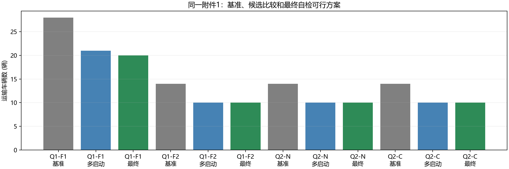
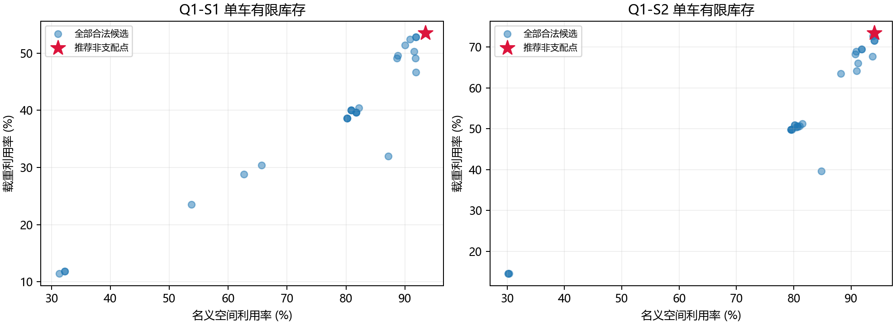
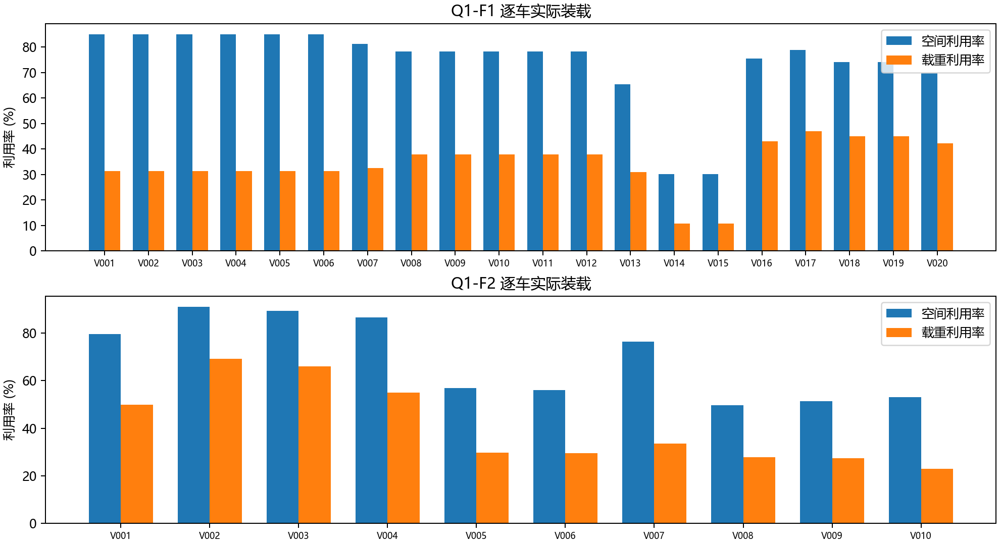
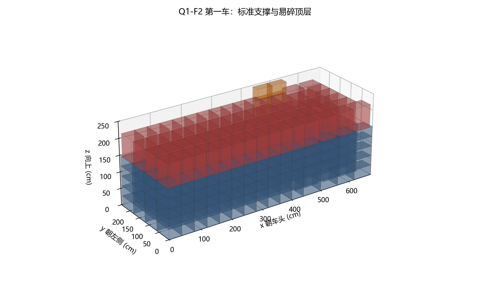
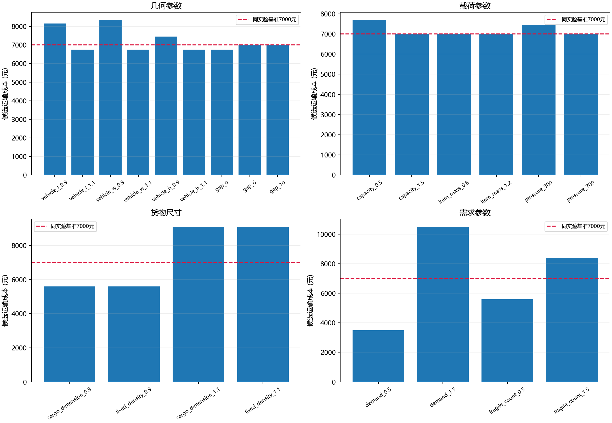

# 混合货物装载与车型配置：考虑单支持和累计承重的三维装箱研究

## 摘要

针对2026年第十六届MathorCup D题给定的混合货物，研究单车选货、单车型整批运输和混合车型配置三个相互关联的决策。附件1包含3000件货物，总体积287.35 m³、总质量41100 kg。建立满足正交朝向、完整底面支撑、易碎件堆叠限制、累计承重和顶部3 cm间隙的装箱模型，并在单支持嵌套竖列这一保守可行域内求解。比较断头式地板分割、最大剩余矩形多启动构造、列模板占地整数规划和成对重装，全部方案展开为逐件坐标并重新核算库存与静态荷载。有限候选集中，车型1推荐单车空间/载重利用率为93.45%/53.53%，车型2为94.04%/73.44%；整批运输仅用车型1得到20车、9000元方案，仅用车型2得到10车、7000元方案。允许混合车型时，最少车与最低费用候选均为10辆车型2。总体积与总重量松弛给出的原问题下界为车型1至少16车、车型2及混合至少7车，混合费用至少4900元，故上述结果均为可行上界。29个人工场景、348次求解表明，在本实例和声明的搜索配置内，部分尺寸、易碎需求和朝向场景改变了所得车队；增加额定载重未减少主场景车数。研究提供完整坐标、程序与参数证据，并保留原三维问题全局最优性和动态运输安全的未验证范围。

关键词：三维装箱；有限库存；单支持；累计承重；非支配选择；车型配置

## 1 从运输需求到六类决策

题面提出提高“满容率”和“满载率”、减少运输车辆及降低运输费用。本文分别称前两项为空间利用率和载重利用率，以名义车厢体积、额定载重为分母。题面虽说明不同货物的单位运输费用相同，但没有收入或各件运价数值，因而本文按明示的利用率、车数和每趟成本建模，不估算利润。

单车决策与整批决策的库存约束不同：单车允许从有限库存选择子集；整批必须把每件货物恰好运走一次。因此，单车高利用率模式不能直接重复成全量配送方案，否则可能反复选取同类货物而遗漏余货。问题2在相同全库存约束下改变目标，允许两种车型；问题3再依据所得方案解释算法表现、参数变化及企业选择。

为避免遗漏，本文把原题整理为六个计算任务。Q1-S1、Q1-S2分别处理车型1、车型2单车的双目标选货；Q1-F1、Q1-F2分别仅用一种车型运完全部货物，以车数最少为主目标；Q2-N允许混合车型并最小化总车数，同车数以费用择优；Q2-C最小化总费用，同费用以车数择优。每个任务均输出车辆归属、逐件坐标、朝向、支撑关系、利用率及未装数量。单车中的未装货物仍留在库存，只有整批任务要求未运数量为零。

附件1提供正式需求和约束。附件2缺少质量、批量和若干运输口径，只用于尺寸解析与单件适配检查；这一证据范围在第9节单独说明。

## 2 数据、单位与主要限制

逐字段核对三份指定原文件的哈希、PDF逐问、DOCX全部参数和XLSX单元格后，规范化附件1数据如下。原值均为正数，数量为整数，类型编号无重复；件号按G1-0001等序列展开。原值及来源定位保存在原执行域的data/raw_audit.json、cargo.csv和vehicles.csv。

| 货物 | 类别 | 尺寸/cm | 单重/kg | 数量 | 体积/m³ | 密度/kg·m⁻³ |
| --- | --- | --- | --- | --- | --- | --- |
| G1 | 标准 | 60×40×30 | 12 | 800 | 57.60 | 166.67 |
| G2 | 标准 | 50×35×25 | 8 | 1000 | 43.75 | 182.86 |
| G3 | 易碎 | 70×50×40 | 15 | 300 | 42.00 | 107.14 |
| G4 | 定向 | 80×60×50 | 25 | 400 | 96.00 | 104.17 |
| G5 | 定向 | 40×40×60 | 18 | 500 | 48.00 | 187.50 |

车型1（T1）的净尺寸为420×210×220 cm，额定载重6000 kg，每趟450元；车型2（T2）为680×245×250 cm、10000 kg、700元/趟。3 cm顶部间隙后的有效体积分别为19.1394 m³、41.1502 m³，空间利用率的名义分母仍为19.404 m³、41.65 m³。货物总体积287.35 m³、总质量41100 kg，G4占其中96 m³。除总体积外，G3上方不能继续放货、G5只能保持40×40×60 cm姿态，也限制空间拼排。

本批货物的最大质量体积密度为G5的187.5 kg/m³。装入一车的货物体积不超过有效车厢体积，因此其质量不超过“最大密度×有效体积”。由此，T1载重利用率上界为59.81%，T2为77.16%；这是未考虑库存与几何损失的宽松界，仍足以排除两车型同时达到100%空间利用率和100%载重利用率。单车研究应比较实际可行的两指标，而不是把同时满容满载设成必达条件。

## 3 约束解释与假设后果

原点位于车厢右后下，x朝车头、y朝左侧、z向上，长度单位cm、质量单位kg、费用单位元/趟，接触比较容差为1e-7 cm。面积由cm²除以10000换成m²，体积由cm³除以1000000换成m³。

标准件允许去重后的正交轴置换，定向件只保持原长宽高。主场景对易碎件也允许正交轴置换；将“仅单层、不可堆叠”解释为其上方不再放置任何货物，同时允许其完整底面贴合地板或标准件顶面。题面没有明确易碎件可否倒置，因此另设保持原高度的场景，不能把主场景朝向假设当作官方澄清。

所有非地板件均由一个下层箱体完整支撑，易碎件的下层须为标准件。本文不利用多个顶面共同支撑，也不允许悬空或部分底面支撑。嵌套底面的竖列易于构造和复核，却缩小了原三维可行域；在该子空间中找到的最好解，只能给原问题提供可行上界。

假设质量均匀，重心位于几何中心。完整底面包含关系保证定向件直接上层的重心位于其投影内。承重按实际接触面积和上方累计质量计算。题目使用kg/m²，这是单位面积承载质量，本文称为承载面密度，而非以Pa计量的机械压强。主场景不把下层本件自重计入其顶面承载量，另检验计自重解释。地板只检查整车额定载重，因为题面未给地板局部承载上限。所有箱体上界均满足z+h≤H−3。

这些假设定义了可检查的静态问题。道路加速度、摩擦、绑扎和作业空间没有输入，静态坐标合法不等于动态运输安全已经认证。

## 4 模型：把几何可行性连接到运输目标

### 4.1 变量、库存与箱体分离

用i表示逐件货物、k表示车辆。a(i,k)为是否把i装入k的0/1变量；单车选择变量为s(i)，整批任务固定s(i)=1。每件选择允许朝向o(i)，得到尺寸d_x(i)、d_y(i)、d_z(i)，其各坐标分量最小的顶点为(x(i),y(i),z(i))。车辆k的尺寸、载重和费用由车型决定。

```text
sum_k a(i,k) = s(i)
当 a(i,k)=1 时：
0 <= x(i); x(i)+d_x(i) <= L(k)
0 <= y(i); y(i)+d_y(i) <= W(k)
0 <= z(i); z(i)+d_z(i) <= H(k)-3
每车：sum_i m(i)*a(i,k) <= M(k)
```

同车任意两件i、j须在至少一个轴上分离，即下面六个不等式至少一个成立：

```text
x(i)+d_x(i) <= x(j) 或 x(j)+d_x(j) <= x(i)
y(i)+d_y(i) <= y(j) 或 y(j)+d_y(j) <= y(i)
z(i)+d_z(i) <= z(j) 或 z(j)+d_z(j) <= z(i)
```

表面相接允许，正体积相交禁止。库存、合法朝向、边界、分离和载重共同约束选货与车辆归属。程序直接构造坐标，并在输出后重新检验这些条件，而不是只按总体积决定可装件数。

### 4.2 支撑链与累计承重

非地板件i的直接支持者记为parent(i)，二者接触表面同高，且支持者投影完整包含i的底面。下层不能是易碎件；若i为易碎件，下层必须标准。竖列形成支撑链，按高度从上到下累加质量。T(i)包括i自重和其上方全部传入质量，A(i)为i与支持者的接触面积：

```text
T(i) = m(i) + sum_{j:parent(j)=i} T(j)
A(i) = d_x(i)*d_y(i)/10000    单位：m²
p(parent(i),i) = T(i)/A(i) <= 500 kg/m²
sum_{地板件i} T(i) = 该车货物总质量
```

这里的p表示承载面密度。它累加上方各层质量，不能只用直接上一层单重判断。计下层自重的场景在对应界面分子中再加入支持者自重。地板传入总质量与车内总货重相等，是检查载荷传播是否遗漏的守恒条件。

### 4.3 单车双目标与车队目标

```text
Uv(k) = 车k货物总体积 / [L(k)*W(k)*H(k)]
Uw(k) = 车k货物总质量 / M(k)
车队Uv = 全部已运体积 / sum_k 名义车厢体积(k)
车队Uw = 全部已运质量 / sum_k 额定载重(k)
N = n1+n2; C = 450*n1+700*n2
```

单车按(Uv,Uw)的非支配关系比较：若一个候选两指标均不低且至少一项更高，则支配另一个候选。推荐规则为先比较空间利用率，相同时比较载重利用率。生成候选时的质量偏好α=0、0.5、1只改变搜索方向，不把双目标改成最终加权得分。Q1-F1、Q1-F2、Q2-N按(N,C)排序，Q2-C按(C,N)排序。车队比率以总容量计算，不直接平均逐车比率。

### 4.4 松弛下界与受限模板优化

总体积和总重量守恒可给必要条件。同车型车数至少为“货物总体积/单车有效体积”和“总质量/额定载重”各自向上取整的较大值。混合目标枚举非负整数n1、n2，要求总有效体积、总额定载重至少覆盖需求，再分别最小化N、C。得到T1至少16车，T2及混合至少7车，混合费用至少4900元。

为组织完整库存，令u(p)为合法竖列模板p的使用次数，要求每类货物数量精确覆盖：

```text
sum_p count(t,p)*u(p) = q(t), 对每个货物类型t
u(p)为非负整数
最小化 sum_p area(p)*u(p)
```

该整数规划只在给定模板库内最小化总占地。解出模板数量之后，仍须二维装入车底、展开三维坐标并检查。库内占地最优、二维装车结果和原三维全局最优属于不同层次，后文分别报告。

## 5 从基准瓶颈到候选改进

### 5.1 地板构造与支持库存

初始模板由一种底层类型及同类层数、可被其完整支持的第二种顶层类型及层数组成，朝向、高度和累计承重均先过滤；易碎件出现后停止。T1、T2初始库分别包含401、536列，每列记录逐层类型/姿态、数量、体积、质量和占地。

基准优先选择大底面的列，用断头式分割维护地板空矩形；分割后难以利用横跨多个片区的空隙。改进构造维护最大剩余矩形，在可容纳的列中综合每单位占地的体积/质量收益、边长贴合和易碎优先级，再分割相交区域、删除被包含的空矩形。初次小批虽合法却没有形成易碎件由标准件支持的关系，暴露了支持库存可能被提前消耗的问题。因此全量构造在可能时为每个剩余G3保留两件G1，并在烟测中明确检查该支持关系。这项修正增加了被检验的装载结构，不把小批通过当成整批完成。

### 5.2 比较配置与实际改进

每任务运行1个基准和27个多启动候选：种子0、11、23，α=0、0.5、1，易碎优先级1、3、6，共168次。每次上限120秒、阶段窗口900秒。坐标检查器另写，从原始尺寸和输出坐标重建约束；生成器返回成功不等于通过检查。单次构造约0.0010—0.1784秒，不含写出和核验；168次比较阶段实测约45.65秒。

随后运行精确库存的列占地整数规划，用多种排序进行二维最佳匹配。初始库最小占地为T1 163.5575 m²、T2 150.4875 m²，HiGHS给出库内最优和相同对偶值；除以车底面积得到库内面积必要下界19/10车，实际布局为20/10车。再对兼容顶面追加货物，最多四轮、30000状态，扩展到1374/2197列；扩展库最小占地未降低，64次装车未改善20/10车。

最后把两车货物合并重装，检验能否减少车数或费用。T1排除体积已超过一车容量的不可能合并对后运行54次，两个混合目标各810次，共1674次，未找到进一步改善。这个结果只针对所用邻域与种子，不是局部或全局最优证明。

| 任务 | 方法 | 车辆数 | 费用/元 |
| --- | --- | --- | --- |
| Q1-F1 | 基准 | 28 | 12600 |
| Q1-F1 | 多启动 | 21 | 9450 |
| Q1-F1 | 最终 | 20 | 9000 |
| Q1-F2 | 基准 | 14 | 9800 |
| Q1-F2 | 多启动 | 10 | 7000 |
| Q1-F2 | 最终 | 10 | 7000 |
| Q2-N | 基准 | 14 | 9550 |
| Q2-N | 多启动 | 10 | 7000 |
| Q2-N | 最终 | 10 | 7000 |
| Q2-C | 基准 | 14 | 9550 |
| Q2-C | 多启动 | 10 | 7000 |
| Q2-C | 最终 | 10 | 7000 |

T1方案由基准28车降为20车，T2由14车降为10车，两者费用相对各自基准降低28.57%。这些数值说明给定程序配置在本实例中获得了更好的可行方案。一次基准与27次多启动、后续整数规划和重装的搜索努力不同，因此不能把改善全部归因为某单一算法在同等总计算预算下更优，也不能推广为其他库存的固定降幅。



## 6 六任务结果及其含义

| 任务 | 车型组成 | 车辆数 | 费用/元 | 空间利用率 | 载重利用率 | 车辆下界 |
| --- | --- | --- | --- | --- | --- | --- |
| Q1-S1 | 1T1+0T2 | 1 | 450 | 93.45% | 53.53% | — |
| Q1-S2 | 0T1+1T2 | 1 | 700 | 94.04% | 73.44% | — |
| Q1-F1 | 20T1+0T2 | 20 | 9000 | 74.04% | 34.25% | 16 |
| Q1-F2 | 0T1+10T2 | 10 | 7000 | 68.99% | 41.10% | 7 |
| Q2-N | 0T1+10T2 | 10 | 7000 | 68.99% | 41.10% | 7 |
| Q2-C | 0T1+10T2 | 10 | 7000 | 68.99% | 41.10% | 7 |

整批四任务各运输G1=800、G2=1000、G3=300、G4=400、G5=500，共3000件，未运数量为零。费用按每趟450/700元计算，不包含未给出的路线或额外库存成本。

### 6.1 单车：利用率高的子集不等于全库存方案

T1推荐装G1=89、G2=268，共357件、18.133 m³、3212 kg，未装数量依次为711、732、300、400、500。T2推荐装G5=408，共39.168 m³、7344 kg，未装G1=800、G2=1000、G3=300、G4=400、G5=92。T2候选只选G5仍符合有限库存任务，说明无需额外强加“每类都装”的配比约束。

两车型各28个候选中均只有1个不同的非支配点。散点图展示整个已检验样本池，星号为推荐点；样本池之外仍可能存在更好的空间布局，故这里不宣称完整连续Pareto前沿。



### 6.2 整批：利用率与费用需要分开判断

20辆T1的名义体积合计388.08 m³、额定载重合计120000 kg，车队空间/载重利用率为74.04%/34.25%。10辆T2为416.5 m³、100000 kg，对应68.99%/41.10%。T1的空间利用率更高，却因车数和单趟费用合计而花费更多；利用率不能替代运输费用目标。逐车图也显示易碎集中车与余货车的装载差异，完整数值在vehicle_summary.csv。



### 6.3 混合目标：当前同解不代表目标等价

原450/700元价格下，按车数和按费用排序均选出10辆T2、7000元，相对20辆T1节省2000元、22.22%。这只是当前可行候选池中的同解现象。第8节的T2费用1000元场景则出现10T2、10000元的最少车候选和12T1+4T2、9400元的费用候选，后者增加车辆以降低费用。目标应由经营约束决定，不能事先互换。

### 6.4 坐标如何转为装载步骤

原执行域plans/各任务/selected/placements.csv提供每件车辆、坐标、尺寸、orientation和support_ids。orientation=yxz表示车x轴取原宽、y轴取原长、z轴取原高。按车分组后，先摆地板箱，再按z从低到高装入；标准支持件先于易碎顶层，卸下上件之前保留支持箱。该顺序实现支撑依赖，但叉车通道和装卸可达性尚未另建模型。

下图仅示Q1-F2第一车，箱体来自已核验坐标；其他车辆由完整CSV提供。不同任务是替代方案，件号在各任务内独立使用，不能跨任务相加。



## 7 验证层次、复现与性能边界

生产者的checker.py不导入构造器，从坐标重建姿态、接触支持和累计质量，核验边界、所有货物对、库存、载重及目标值。正式六任务共有2380553对货物，最大累计界面承载面密度384.00 kg/m²，最小顶部间隙5.00 cm，均满足主场景约束。28件烟测包含标准、易碎和定向件；人工越界9999 cm和承载阈值1 kg/m²的副本均被拒绝。

小实例保持G1原尺寸和单重，设车厢60×40×63 cm、间隙3 cm、库存4件G1。有效体积144000 cm³是单件72000 cm³的两倍，体积上界为2件；程序叠放2件达界。该精确结论只用于验证小实例和基本构造，不外推到原批次。

原执行在新输出目录实际重新计算六任务，其中T1整批重求模板MILP与二维布局，其余任务按冻结配置构造；车数、费用、利用率、库存和坐标均一致。一轮fresh1包含写出与自检约1.666秒，是该机器的一次观测。后续fresh3还绑定了最终数值代码、配置和数据哈希。

除生产者自检外，另一个审查者从原件重建输入，复算六任务、168候选、348参数及四个库整数规划，并以自有检查器核查主要空间和数值结果；验证范围仍是明确的单支持、均匀质量和静态条件。64次扩展装车与1674次历史重装未被完整重复验证，其记录作为未改善研究保留。文档版本、导出检查和历史运行限制由接收入口README及qa/、logs/提供。

设P为列模板数、R为空矩形数、K为选列数，地板候选比较约O(P×R×K)，朴素包含片删除为O(R²)。每车n_k件的逐对几何和支持搜索均为O(n_k²)。整数规划复杂度与类型、模板库和需求共同有关，现有耗时不足以保证更大实例速度。Python3.12.8及numpy1.26.4、scipy1.17.1、matplotlib3.10.9为原运行环境。

## 8 参数实验：观察、解释和适用条件

29个人工场景分别改变指定字段，其他字段保持原值；统一使用最大剩余矩形构造、α=0.2、易碎优先级3和种子0/11/23，对两个单车与两个混合目标重求，共348次调用。两个混合目标共享已检查的候选池，再按各自目标选择。下表为费用候选；“费用候选”只指这个有限池内费用最低，所有输入变化、坐标和检查保存在原sensitivity/。

| 参数场景 | T1数量 | T2数量 | 总车数 | 费用/元 | 空间利用率 | 载重利用率 |
| --- | --- | --- | --- | --- | --- | --- |
| base | 0 | 10 | 10 | 7000 | 68.99% | 41.10% |
| vehicle_l_0.9 | 1 | 11 | 12 | 8150 | 66.86% | 35.43% |
| vehicle_l_1.1 | 1 | 9 | 10 | 6750 | 66.26% | 42.81% |
| vehicle_w_0.9 | 3 | 10 | 13 | 8350 | 67.26% | 34.83% |
| vehicle_w_1.1 | 1 | 9 | 10 | 6750 | 66.26% | 42.81% |
| vehicle_h_0.9 | 1 | 10 | 11 | 7450 | 73.24% | 38.77% |
| vehicle_h_1.1 | 1 | 9 | 10 | 6750 | 66.26% | 42.81% |
| gap_0 | 1 | 9 | 10 | 6750 | 72.88% | 42.81% |
| gap_6 | 0 | 10 | 10 | 7000 | 68.99% | 41.10% |
| gap_10 | 0 | 10 | 10 | 7000 | 68.99% | 41.10% |
| capacity_0.5 | 0 | 11 | 11 | 7700 | 62.72% | 74.73% |
| capacity_1.5 | 0 | 10 | 10 | 7000 | 68.99% | 27.40% |
| item_mass_0.8 | 0 | 10 | 10 | 7000 | 68.99% | 32.88% |
| item_mass_1.2 | 0 | 10 | 10 | 7000 | 68.99% | 49.32% |
| pressure_300 | 1 | 10 | 11 | 7450 | 65.92% | 38.77% |
| pressure_700 | 0 | 10 | 10 | 7000 | 68.99% | 41.10% |
| cargo_dimension_0.9 | 0 | 8 | 8 | 5600 | 62.87% | 51.38% |
| fixed_density_0.9 | 0 | 8 | 8 | 5600 | 62.87% | 37.45% |
| cargo_dimension_1.1 | 0 | 13 | 13 | 9100 | 70.64% | 31.62% |
| fixed_density_1.1 | 0 | 13 | 13 | 9100 | 70.64% | 42.08% |
| demand_0.5 | 0 | 5 | 5 | 3500 | 68.99% | 41.10% |
| demand_1.5 | 0 | 15 | 15 | 10500 | 68.99% | 41.10% |
| fragile_count_0.5 | 0 | 8 | 8 | 5600 | 79.94% | 48.56% |
| fragile_count_1.5 | 0 | 12 | 12 | 8400 | 61.69% | 36.12% |
| T2_cost_450 | 0 | 10 | 10 | 4500 | 68.99% | 41.10% |
| T2_cost_1000 | 12 | 4 | 16 | 9400 | 71.94% | 36.70% |
| fragile_upright | 1 | 14 | 15 | 10250 | 47.69% | 28.15% |
| fragile_floor | 0 | 11 | 11 | 7700 | 62.72% | 37.36% |
| own_mass_pressure | 0 | 10 | 10 | 7000 | 68.99% | 41.10% |

### 8.1 净尺寸和顶部间隙

车厢长、宽、高分别±10%，单趟费用保持不变，是净尺寸研究场景而非车型报价。缩短10%所得费用候选为12车8150元；缩窄10%为3T1+10T2、13车8350元，而该场景车数候选为12T2、8400元，形成“多1车、少50元”的权衡。三种增大尺寸场景均得到1T1+9T2、6750元。空间利用率分母随车体体积变化，较低比率本身不能判断费用更高。

0/6/10 cm间隙场景分别得到10车6750元、10车7000元、10车7000元。0 cm违反正式3 cm要求，只用于观察高度阈值。层数和顶层朝向是离散决策，间隙变化可能造成跳变；这些点不能建立普遍连续的成本函数。

### 8.2 额定载重、货物质量和承载面密度

额定载重降低50%得到11T2、7700元，车队载重利用率74.73%；提高50%仍得到10T2、7000元，载重利用率降为27.40%。在本批需求和搜索配置内，增大额定载重未改善所得车队，提示后续优化优先检查空间拼排与易碎支持。货物单重独立±20%、尺寸固定时仍为10T2，载重利用率分别32.88%/49.32%。这些是已运行场景的观察，不证明额定载重或单重对其他实例无影响。

承载面密度上限由500降至300 kg/m²时，所得费用候选变为1T1+10T2、7450元；提高至700时仍10T2、7000元。上限改变合法堆叠层数，是模型内的可解释作用路径，车数变化仍取决于构造搜索。把下层自重计入界面分子的替代场景也得到10T2、7000元；这是新构造的结果，不证明原坐标在所有承重解释下均合法。

### 8.3 箱体尺寸、批量及易碎比例

所有货物尺寸缩小10%、质量不变时得到8T2、5600元，扩大10%时13T2、9100元。固定密度分支则同时把单重乘尺寸比例三次方，车数和费用在本次搜索中相同，但载重利用率不同。两种分支对应不同物理假设，不能合并成一个尺寸效应。

全类型数量0.5倍、1.5倍得到5T2、3500元和15T2、10500元，三个观测点呈比例关系；整数余货效应使这一关系不能保证适用于任意批量。仅G3数量减半得到8T2、5600元、空间利用率79.94%；增加50%得到12T2、8400元、61.69%。不可继续承载的易碎顶层与支持库存限制，是解释该变化时应检查的结构。

### 8.4 费用比例与易碎朝向

T2费用450元时费用候选仍为10T2、4500元；1000元时为12T1+4T2、16车9400元，而车数候选10T2需10000元。成本变化没有改变几何规则，两个目标因此可以在同一可行池内直接比较；本实验也按统一配置重新搜索，未把重估旧方案价格称为重新证明最优。

G3保持原高40 cm且只作平面旋转时，底面70×50或50×70 cm不能被单个G1或G2完整包含，故在本文单支持域中只能放地板，所得方案为1T1+14T2、15车10250元。若仍允许正交置换但强制易碎落地，得到11T2、7700元。与主场景10T2、7000元比较可见，朝向和支持解释会改变建议；企业必须先确认包装规则，再选相应坐标。

下图比较几何、载荷、货物尺寸和需求四组人工场景的费用候选。虚线是同配置基准7000元，不表示最优成本；费用比例和解释场景见上表及本节文字。



## 9 附件2：有界的通用性检查

仓库箱体区间取上端、封闭公路车净尺寸区间取下端，统一转为cm；化验值另存，不混合选择有利端点。8类产品和5行可按长方体封闭箱体处理的公路车形成40个单件几何组合，在人工假设允许正交旋转且留3 cm间隙时均可适配。

这验证尺寸解析和单件适配，不验证官方整批运输。附件2没有完整质量、数量、类型、额定载重或距离，元/1000 km也不能直接作为元/趟。铁路/水路费用口径不清的行、只有栏板高度的车型和阶梯车厢不纳入本长方体模型。完整大批次泛化仍缺所需业务输入。

## 10 结论与企业实施条件

在本文主解释及当前已核验候选范围内，允许两车型时推荐10辆T2、7000元；只允许T1时采用20辆、9000元。推荐建立在明确库存和静态承重条件上，使用前先确认易碎朝向、可支撑顶面和实际包装承载能力，再按车辆及支持顺序装卸。

可行上界与原问题下界仍有差距：T1为20与16车，T2/混合为10与7车，混合费用为7000与4900元。相对下界的差为25.00%、42.86%和42.86%，只是界间差，不是与未知真实最优值的精确误差。单支持嵌套列、二维碎片化及有限搜索限制了解质量。若继续改善，优先研究多顶面联合支撑的载荷分配和更紧几何界，并扩充单车非支配候选；这些工作未完成前不提高最优性措辞。

## 参考材料

[1] 指定原文件《2026年第十六届MathorCup数学应用挑战赛题目—D题.pdf》，3页。

[2] 指定原文件《附件1.docx》，车辆参数段落4—10、类别段落13—16、承重/间隙段落18—19及表1。

[3] 指定原文件《附件2：验证数据集.xlsx》，箱装产品尺寸、车型尺寸和Sheet3。原文件哈希及字段定位见原执行域data/raw_audit.json。本研究没有借用外部题解或虚构文献。

## 附录：版本、程序和接收路径

本修订域为execution-v2，数值底座为同层冻结execution。当前README列出组合包路径及只向新域输出的运行方式。原src/solver.py、checker.py、column_milp.py、deep_columns.py、local_search.py和reproduce.py保持原字节；原data/、plans/、experiments/、sensitivity/、replay/、evidence.csv提供数值和逐件证据，本域figures/是原图及CSV的逐字节副本。

正文结论由逐件坐标、库存守恒、静态荷载核算和参数结果支撑，原三维全局最优与动态运输安全保持未验证。组合接收入口README提供程序身份、复现步骤、文档核查和完整运行限制；这些记录用于判断可复现范围，不改变本研究的条件结论。
