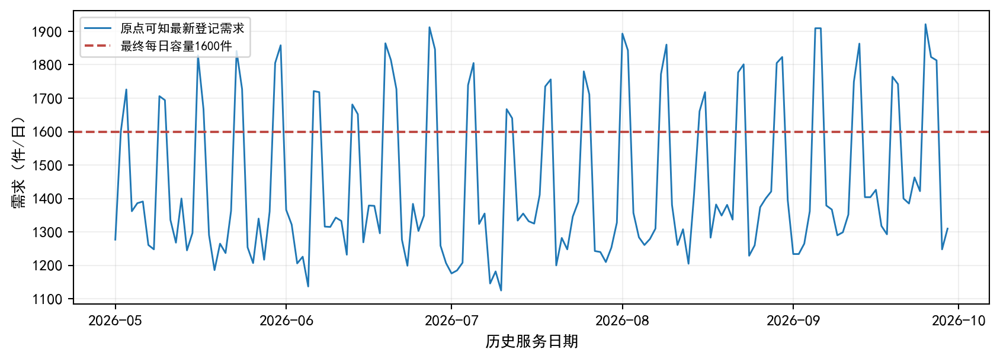
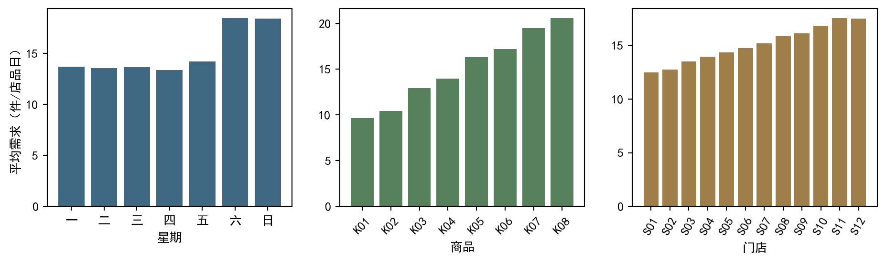
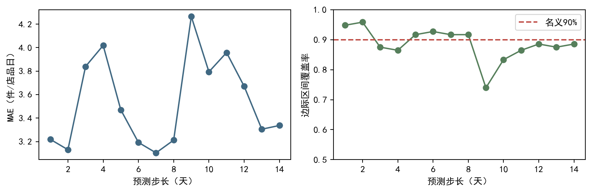
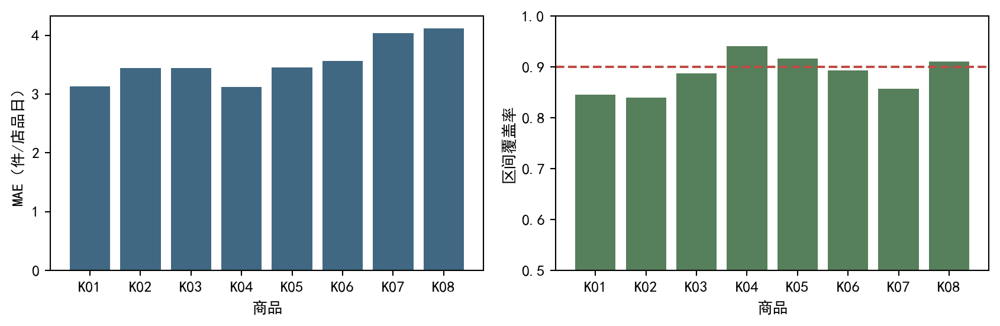
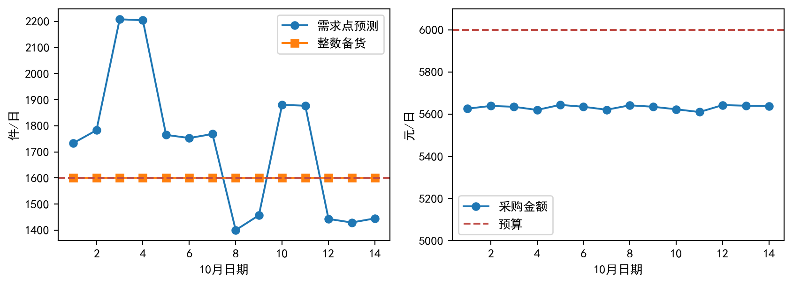
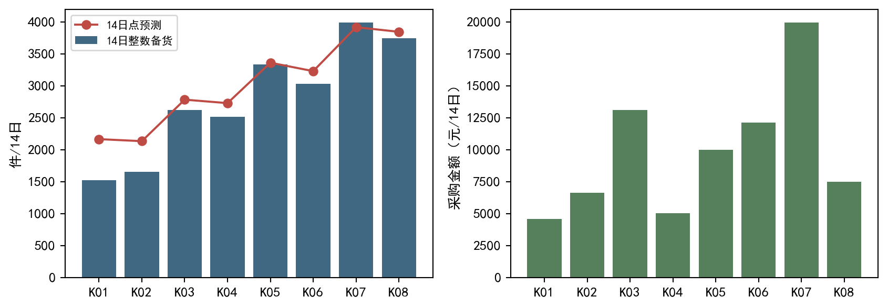
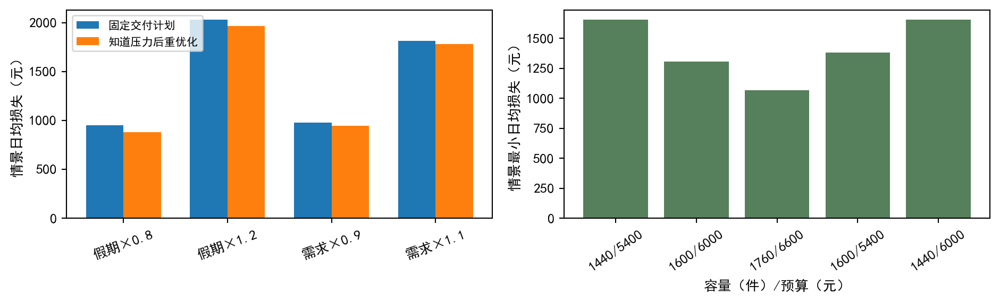

# 带信息发布时间约束的连锁鲜食需求预测与集中备货

原创合成数据离线建模研究 | 决策原点：2026年9月30日18:00（北京时间）

## 摘要

针对12家门店、8种当日鲜食的一次性14日集中备货任务，本文先依日报版本及发布时间重建信息快照，再比较星期统计与共享岭回归，最后在原题双资源约束下最小化经验需求分布的缺货和浪费损失。最终原点有14592个可用历史店品日标签，96条9月30日日报因晚到被排除。以三个历史原点的同约束日均损失选出shared_ridge10，保留的9月16日原点14天验证中，MAE为3.54件/店品日，经验90%区间覆盖率为88.62%，随机需求方案日均损失为1093.65元，较相同点预测的可行贪心方案低14.24%。交付期每日备货1600件，14日合计22400件、采购78851元，全部满足商品上限及每日6000元预算。资源压力研究显示容量比当前预算更紧，假期连续7天效应及长天气预报迁移仍是主要不确定来源。上述损失为历史回测或情景计算，未来真实需求未提供，不能解释为已实现未来收益。

关键词：信息可用性；固定原点预测；经验残差；整数备货；缺货与浪费；资源约束

## 1 问题、口径与建模假设

总部必须在既定原点一次确定10月1日至14日计划，之后不引入新日报、天气预报或促销公告。一天的商品不能跨日结转，未满足需求流失。因此各天资源独立，店品之间通过每日总容量及采购预算耦合。需求是日报登记的需求件数，并非由结算额反算的销售量；原题不提供真实商业记录，也不允许据比赛名称推断正式赛制。本文完整回答需求规律与预测、整数备货与可靠性、可重跑程序与中文论文三项要求。

| 符号 | 定义 | 单位 |
| --- | --- | --- |
| d,s,k | 服务日期、门店、商品 | 索引 |
| D / mu | 随机需求 / 需求点预测 | 件 |
| q / m | 非负整数备货 / 商品每日上限 | 件 |
| c / a / b | 采购成本 / 缺货损失 / 浪费损失 | 元/件 |
| C / B | 每日容量1600 / 预算6000 | 件 / 元 |
| O / H | 决策原点 / 预测期14日 | 北京时间 / 天 |
| e(r) | 完整日期r的96维预测误差 | 件 |

表1 符号和单位。表中a、b与c均直接读取items.csv。

采用四项工作假设。第一，可用最新日报是原点条件下训练需求的最佳登记值，保留修订而不把多个版本平均；若登记错误系统性持续，预测也会受影响。第二，各店品的星期、缓慢趋势和促销关联在短期内具有可迁移性，这是统计假设而非因果机制。第三，历史固定原点误差可用于构造未来边际风险的经验近似，相关结构仅沿同日店品向量保留，不提供严格覆盖保证。第四，采购只占预算，不加入原题损失，且没有隐含调拨、运输、跨日或公平性约束。这些假设使模型与原题一致，也明确了结论的适用范围。

## 2 原件审计与可知信息重建

需求表原始17577行，完全重传去重8行，含14688个日期店品键。同键同revision无冲突，版本到达顺序单调；需求非负有限且为整数。各维表主键、主外键、星期与日期一致性、促销比例[0,1]、成本及上限值域均经程序检查。每次连接指定一对一或多对一，避免行数放大。原件和冻结设计的35个文件哈希以及设计manifest均实际验证。这些检查说明输入身份与处理口径，不证明预测效果。

$$
\mathcal{I}(O)=\{x:\mathrm{available\_at}(x)\leq O\}
$$

快照先按available_at不晚于原点筛行，再在每个日期、门店、商品键上取最高可用revision；同revision冲突将触发拒绝。时戳按题目统一ISO格式解析并绑定Asia/Shanghai时区，服务日期在原点前也仍必须检查发布时间。原点9月30日18:00只知道5月1日至9月29日的152天、14592行需求；9月30日日报在10月1日09:00才到达，故不能训练。settlement_yuan与结果一起到达，整条建模链不使用它。行级溯源保存原行号、内容哈希、版本、发布时间、原点及用途。

| 历史原点 | 训练行数 | 末训练日期 | 后续需求值修订数 |
| --- | --- | --- | --- |
| 2026-07-08 | 6528 | 2026-07-07 | 14 |
| 2026-07-22 | 7872 | 2026-07-21 | 10 |
| 2026-08-05 | 9216 | 2026-08-04 | 15 |
| 2026-08-19 | 10560 | 2026-08-18 | 14 |
| 2026-09-02 | 11904 | 2026-09-01 | 19 |
| 2026-09-16 | 13248 | 2026-09-15 | 14 |

表2 逐原点训练快照。后续修订仅用于展示口径差异，不提前回填训练。

天气共960行、雨量缺失17处。历史14日原点仅可获次日三区预报；最终14日则有9月30日16:00同批42条预报，其中2个雨量未记录。历史逐日次日预报不能拼成原点已知14日预报，实况也不能补成未来特征。训练与预测均不使用天气，从而避免未经验证的预报尺度迁移；历史误差保留了天气波动的影响。后验配对有444条非缺失预报与实况，雨量预报MAE为2.12毫米，仅作数据可靠性诊断。未来天气预报内容保存于特征溯源中，供复核其已知性，未进入回归矩阵。

促销以announced_at筛选，历史每个14日窗口前10天计划已知、后4天未公布。未知不等于明确无折扣：后4天使用该原点最近56日已可知训练记录的商品平均折扣，保留promo_known指示和来源。最终1344个促销计划均已公布，使用实际计划。日历视为事先已知。缺失雨量保持缺失，未强行转成零雨量。

## 3 门店、商品与日期需求规律

图1 最终原点可知历史需求总量与容量参照线。参照线用于理解资源，不是历史企业已实施容量。

图1显示需求总量在日期间波动明显，历史日均总量为1446.55件，最低1125件、最高1921件。单纯以全期平均备货会忽视周期和同日共同波动，故需日期条件预测。曲线保留全部可用需求，没有删掉高需求日期来改善误差。

图2 同一可知快照的星期、商品和门店平均需求。均按实际可用店品日计算，无跨版本重复加权。

图2中星期日均店品需求范围为13.38至18.46件，商品均值范围9.64至20.58件，门店均值范围12.48至17.55件。这说明共享模型需同时保留店品水平与商品星期效应，不能只拟合总部总量。不同门店的区域归属为3个区、每区4店；本文不据这些相关差异宣称区域或促销因果效应。商品和门店组均值的时间组成相同，但节假日与促销可与趋势同时发生，组比较仍有混杂。

历史holiday=1只有2个独立日期，非节假日与节假日的店品均值分别为15.01和19.71件。96条同日店品记录不能视为96个独立节日重复。未来10月1日至7日连续7天，历史的单日现象不能保证长段效应。因此主模型的节日项受强收缩，且必须单独报告假期压力测试。

## 4 固定原点预测模型与时间实验

先使用可解释星期基线：每店品取原点前最近56天的同星期需求中位数；若缺组，退回该店品可用训练均值。另一统计候选使用最近84天同星期均值，以检验更稳定平均是否优于中位数。前者对极端值较稳，后者保留均值意义，但两者都难以反映缓慢趋势与已公开促销。由这一弱点提出共享岭回归，而不是先预设复杂模型胜出。

$$
\widehat{\beta}=\arg\min_{\beta}\{\sum_{i\in\mathrm{train}}(y_i-X_i\beta)^2+\lambda\|\beta\|_2^2\}
$$

$$
\mu_{dsk}=\max\{0,\alpha_{sk}+\gamma_{k,w(d)}+\tau_k t_d+\pi_k p_{dsk}+0.3\eta h_d\}
$$

回归矩阵共169列：96个店品截距、56个商品×星期指示、8个商品线性时间项、8个商品折扣项和1个全局节假日项。时间t为自5月1日算起的天数除以30；p为可知折扣或训练均值替代；h为日历假日指示。模型不另设公共截距，所有系数接受同一岭惩罚。holiday列乘0.3意味着相同实际节日效应需更大系数，从而承受约1/0.09倍的惩罚，压低小样本节日外推。所有候选在同一可知输入集上运行，lambda=10与100用于比较适度共享和较强收缩；结果不会改变候选名单。点预测截断为非负，可为非整数。

时间分割在任何模型成绩产生前保存于experiment.json：7月8日原点的7月9日至22日预测只启动误差池；7月22日、8月5日、8月19日三个原点用于选模；9月2日原点补充校准；9月16日原点的9月17日至30日是保留验证。每次训练到当时可知最新版本，一次预测全部14天，后续不每日重训。历史评价用附件中截至10月4日18:00已到达的最新标签，仅进入评价和在确已到达后进入误差池。未来实际真值不在附件中。

选择准则为三个选择原点的随机需求整数政策日均实际损失最小，完全相同时按冻结候选顺序决定，同时检查MAE、RMSE、偏差与覆盖率。原题重视集中备货损失，故不在结果出来后改成按预测MAE选胜者。选择窗服务日期互不重叠；各店品共享日期环境，统计总结按原点及日期理解，不把4032个键当作独立试验去构造虚假显著性。保留验证查看后没有改参数，最终重新拟合全部原点可用历史标签是部署步骤，不是再选模。

| 候选 | 选择MAE（件） | 选择RMSE（件） | 选择日均损失（元） | 区间覆盖（%） |
| --- | --- | --- | --- | --- |
| shared_ridge10 | 3.63 | 4.57 | 1063.20 | 82.47 |
| shared_ridge100 | 5.71 | 6.90 | 1086.41 | 81.82 |
| weekly_mean84 | 3.73 | 4.73 | 1126.51 | 82.79 |
| weekly_median56 | 3.90 | 4.93 | 1180.33 | 82.51 |

表3 三个选择原点的等权均值，政策均为同约束经验分布整数优化。覆盖率随可用校准样本累积变化。

据表3选定shared_ridge10。强收缩lambda=100的预测误差更大，说明这份资料中的店品和星期差异被压缩过度；经验误差校准可抵消部分水平偏差，所以它的备货损失未按MAE同等比例恶化。共享lambda=10相较星期统计有较低损失，但该结论只覆盖真实历史可知信息条件，不能推广成所有天气或国庆状态下必然占优。

## 5 不确定性、校准与保留验证

使用固定原点预测的外样本误差，而不用训练拟合残差伪装预测风险。对每个历史目标日期r形成按固定店品顺序排列的96维误差e(r)=实际需求-点预测，向量保留同日门店商品的共同波动。其ready时间为该日96条评价标签available_at的最大值；只有ready不晚于新原点的完整向量才进入校准。末端未到达修订的向量被排除，即使该日已有较早版本也不使用最终版本偷看。校准lineage逐原点保存日期、来源原点及ready。

$$
D^{(r)}_{dsk}=\max\{0,\mu_{dsk}+e^{(r)}_{sk}\},\quad w_r=1/R
$$

每个向量等权生成需求情景，负需求截为零；使用经验5%及95%分位数形成名义90%边际区间。最终原点有83个已完整到达的日期向量，来源最早2026-07-09、最晚2026-09-29。原始误差不人为居中，因此经验分布可同时表达外样本偏差和离散波动，点预测与情景均值不必相同。各日目标可单独用该日边际情景求解。附件情景表把同一历史向量沿14日重复作为压力依赖约定，保留同日相关；这不等于已识别的跨日联合分布，本文不据此报告14日总损失尾部保证。

| 方案 | MAE（件） | 日均损失（元） | 缺货（元/日） | 浪费（元/日） | 覆盖（%） |
| --- | --- | --- | --- | --- | --- |
| shared_ridge10/stochastic | 3.54 | 1093.65 | 778.31 | 315.33 | 88.62 |
| shared_ridge10/point_greedy | 3.54 | 1275.23 | 1022.31 | 252.92 | 88.62 |
| weekly_median56/stochastic | 4.09 | 1222.09 | 873.85 | 348.24 | 86.53 |
| weekly_median56/point_greedy | 4.09 | 1610.45 | 1401.57 | 208.88 | 86.53 |

表4 最后保留14日验证。MAE单位为件/店品日，损失按原式算，不加采购。

保留验证中选定方案MAE=3.54、RMSE=4.50件/店品日，日总点预测平均偏差为44.64件，区间平均宽度14.02件。实际覆盖率88.62%低于名义90%，尤其早期校准向量较少时覆盖不足。这里不是交换性条件下的严格共形区间，而是有限日期经验分布；覆盖只能评价已发生历史，不可给未来声称分布无关保证。

图3 保留验证按步长误差与覆盖率。每步96店品，共同日期波动会影响整列。

图4 保留验证的商品误差与覆盖率。总体覆盖不等于各商品均达到90%。

图3中步长MAE范围3.10至4.27件，覆盖范围73.96%至95.83%。图4中误差最大的商品为K08（MAE 4.12件），覆盖最低的商品为K02（83.93%）；门店分解的最高误差是S11（4.03件）。这些差异保留于附件，不用总体平均掩盖局部失败。最后窗口含9月25日单日假日，但仍不能校验10月连续7日假期。历史远期未知促销与最终全部公开计划也存在信息形态差别；最终新增公开计划的收益不能直接从历史表推断。

## 6 从预测分布到整数集中备货

$$
L(q,D)=\sum_{s,k}\{a_k\max(D_{sk}-q_{sk},0)+b_k\max(q_{sk}-D_{sk},0)\}
$$

$$
\min_q\ \sum_{s,k}g_{sk}(q_{sk}),\quad g_{sk}(j)=\frac{1}{R}\sum_r L_{sk}(j,D^{(r)}_{sk})
$$

$$
q_{sk}\in\{0,\ldots,m_k\},\quad\sum_{s,k}q_{sk}\leq1600,\quad\sum_{s,k}c_kq_{sk}\leq6000
$$

L_sk表示该店品的两项正部损失之和。逐日先预计算每个店品j=0至55的情景平均损失g(j)。因为正部函数凸，增加一件的收益Delta(j)=g(j-1)-g(j)随j非增。用每件边际选择的0/1变量建立整数线性模型，目标为最小化g(0)减去所选边际收益，资源矩阵只有总件数和采购成本两行。负收益不选；同一店品内各件资源代价相同，若高序号被选而低序号未选，交换不减收益且不改资源，故最优可排列成前缀。程序按被选件数恢复q，并重新检查真实g(q)与求解目标一致；不依赖任意缩放分位数。

$$
\min_x\ \sum_i g_i(0)-\sum_i\sum_{j=1}^{m_i}\Delta_i(j)x_{ij},\quad x_{ij}\in\{0,1\}
$$

无资源约束的单店品一阶平衡给出临界需求分位数a/(a+b)，本题约为0.80；缺货成本较大，风险方案倾向多备。但双约束会让高损失、高边际改善的店品争取稀缺资源，不能将所有分位数直接取整后宣称全局最优。采购金额只是c×q预算占用，与缺货、浪费损失不同，本文从不重复计入目标。点值参考政策从零逐件按正边际改善/采购成本贪心，达到资源或无改善即停止，始终可行但没有最优性声明。

实际使用SciPy milp求解，历史224个模型日问题、最终14个日问题均保留状态、界、gap及时间。最终状态集合为[0]，最大相对gap=0.0000000000，最大目标与下界差=0.00000000元。小规模测试嵌入3个店品，在容量4件、预算14元下枚举23个组合，整数求解和穷举损失均为11.41666667元；零需求、零资源得到q=0。负、小数、NaN、Inf、商品超量、容量超量和预算超额均实际触发拒绝。这些证据支持所建经验目标的整数最优性及可行性，不支持真实未来最优。

在保留验证同一点预测下，随机需求政策相较点贪心日均损失低14.24%，主要表现为缺货项从1022.31降至778.31元/日，同时浪费项从252.92升至315.33元/日；它付出了更多库存和浪费以减少昂贵缺货。比较同时改变分布处理与优化方式，故该百分比是整套政策差异，不能全部归因于区间校准。相同随机整数政策下，选定预测与星期中位基线的日均损失差为10.51%，更接近预测方法作用。样本只有一个保留窗口，不声称显著长期收益。

## 7 未来14日方案与资源分配

| 10月日期 | 点预测（件） | 备货（件） | 采购（元） | 容量余量 | 预算余量（元） | 情景损失（元/日） |
| --- | --- | --- | --- | --- | --- | --- |
| 10-01 | 1733.7 | 1600 | 5626 | 0 | 374 | 1162.51 |
| 10-02 | 1783.2 | 1600 | 5639 | 0 | 361 | 1270.23 |
| 10-03 | 2208.5 | 1600 | 5635 | 0 | 365 | 2568.69 |
| 10-04 | 2204.8 | 1600 | 5620 | 0 | 380 | 2556.06 |
| 10-05 | 1765.3 | 1600 | 5644 | 0 | 356 | 1229.66 |
| 10-06 | 1753.3 | 1600 | 5635 | 0 | 365 | 1203.71 |
| 10-07 | 1768.7 | 1600 | 5621 | 0 | 379 | 1237.48 |
| 10-08 | 1400.3 | 1600 | 5642 | 0 | 358 | 793.19 |
| 10-09 | 1457.2 | 1600 | 5635 | 0 | 365 | 814.84 |
| 10-10 | 1880.5 | 1600 | 5623 | 0 | 377 | 1519.81 |
| 10-11 | 1877.2 | 1600 | 5610 | 0 | 390 | 1509.83 |
| 10-12 | 1443.2 | 1600 | 5643 | 0 | 357 | 807.91 |
| 10-13 | 1429.4 | 1600 | 5640 | 0 | 360 | 802.59 |
| 10-14 | 1445.2 | 1600 | 5638 | 0 | 362 | 809.19 |

表5 最终原点一次性方案。损失是经验情景期望，非未来实测。完整1344行需求、区间和整数备货另附CSV。

图5 未来需求点预测、最终整数备货及采购预算占用。所有线条除约束线外均为预测或计划。

全部14天使用容量1600件，采购范围5610至5644元/日，预算仍有356至390元余量。14日共22400件，采购78851元。图5中10月3日、4日的假期与周末项叠加，点需求显著超过容量；10月8日等工作日点需求低于容量，经验误差与高缺货损失仍使风险政策把容量用满。因此相同总部总量不代表逐店品平均分配，也不意味着每一天点需求刚好等于1600。

图6 14日商品分配和采购占用。点需求曲线不是应全部满足的确定需求。

| 商品 | 备货（件/14日） | 点需求（件/14日） | 采购（元/14日） | 缺货损失（元/件） |
| --- | --- | --- | --- | --- |
| K01 | 1519 | 2163.6 | 4557 | 3.1 |
| K02 | 1654 | 2131.8 | 6616 | 3.7 |
| K03 | 2620 | 2781.5 | 13100 | 4.3 |
| K04 | 2514 | 2727.2 | 5028 | 4.9 |
| K05 | 3331 | 3359.7 | 9993 | 5.5 |
| K06 | 3030 | 3227.9 | 12120 | 6.1 |
| K07 | 3991 | 3915.4 | 19955 | 6.7 |
| K08 | 3741 | 3843.5 | 7482 | 7.3 |

表6 商品资源分配摘要。门店分配摘要与逐店品表同版本输出。

图6和表6中备货最多的是K07（3991件），最少为K01（1519件）。分配由需求分布、边际缺货改善、浪费惩罚和成本共同决定，不能仅按商品成本排序解释。K04、K08采购成本较低且缺货损失较高，使用单位预算可获得较多缺货改善；高成本商品占预算多，但并非必然少备，还取决于预测需求。门店差异通过各店品水平和误差进入优化。目标没有公平约束，所以损失最小的分配不承诺门店公平或每店服务率一致。

经验情景日均损失平均1306.12元，峰值为2026-10-03的2568.69元。每日90%损失分位数保存于decision_summary.csv，仅描述该经验日分布的尾部，受84天以内历史残差和节日迁移制约。未来缺货、浪费均未观测；实施后应利用新标签再审计覆盖及偏差，但这不改变当前冻结计划。

## 8 可靠性、资源取舍与失效范围

压力测试不是新观测，也不把未给出的天气-需求弹性估计成事实。假期需求情景在10月1日至7日分别乘0.8、1.2，检验单日假期向连续七日外推；全期需求情景分别乘0.9、1.1作为长天气预报迁移及其他需求水平偏移的代理，命名weather只是压力来源标签，绝非雨量每增加一毫米就对应10%需求变化。每个压力同时计算固定交付计划损失，以及已知该压力后重优化的损失。后者是适应性参考，不能冒称决策时就能预知压力。

图7 左：需求压力下固定与重优化方案；右：原约束外资源比较。右侧变化不能替代最终1600件/6000元约束。

| 需求压力 | 固定损失（元/日） | 重优化损失（元/日） | 14日备货绝对变化（件） |
| --- | --- | --- | --- |
| holiday_0.8 | 948.23 | 881.08 | 1332 |
| holiday_1.2 | 2028.91 | 1965.09 | 1998 |
| weather_0.9 | 975.02 | 942.98 | 1272 |
| weather_1.1 | 1812.33 | 1781.14 | 1516 |

表7 对交付计划的需求迁移压力。绝对变化是逐店品日数量差的绝对值之和。

| 容量（件/日） | 预算（元/日） | 情景最小损失（元/日） | 平均备货（件/日） | 平均采购（元/日） |
| --- | --- | --- | --- | --- |
| 1440 | 5400 | 1655.97 | 1440.00 | 5069.29 |
| 1600 | 6000 | 1306.12 | 1600.00 | 5632.21 |
| 1760 | 6600 | 1067.69 | 1735.71 | 6112.36 |
| 1600 | 5400 | 1382.19 | 1570.07 | 5400.00 |
| 1440 | 6000 | 1655.97 | 1440.00 | 5069.29 |

表8 容量与预算压力。除1600/6000行外均是比较实验，不是交付方案。

将容量单独降为1440而预算维持6000，日均情景最小损失由1306.12升至1655.97元；预算单独降为5400时升至1382.19元。容量压缩代价更大，与最终容量每天耗尽而预算尚有余量一致。扩大容量与预算能减少情景损失，但依赖所建需求分布，不是购买资源后真实收益的承诺。少量预算余量仍可能有价值：预算降低后会改变商品组合并可能不能把容量用满，两个约束不能简单等价。

最终回归实际节日加成为3.56件/店品日，它只由两个历史节日及其他相关信息支撑，不代表真实国庆弹性。表7中假期上调时固定损失增加、分配变化明显，说明即使历史MAE较低，连续假期需求水平仍影响决策。方案的可靠性主要是硬资源可行性、历史同条件表现和明确压力边界，不是保证未来不会缺货。没有用更复杂算法掩盖缺少长预报历史和长假期样本的问题。

## 9 可复现实现、作者检查与结论

主入口code/run.py仅从原始附件、输入锁、设计锁和执行配置开始：先验锁与审计，再逐原点快照、特征和误差池，产生历史比较、最终预测、整数备货、压力表、图与论文。report.py读取机器结果生成本文所有动态数字及表格；Markdown与PDF来自同一结构块，防止手工改表漂移。CSV统一UTF-8、ISO日期、稳定店品排序；需求点预测无需整数，q严格为非负整数。环境版本、命令起止、完整输出和退出码在交付包内。模型/tokens/cost未有真实遥测，均为null。

核心文件：results/future_predictions.csv含唯一日期/门店/商品键、点需求、90%区间和名义水平；future_replenishment.csv含同样1344键及q_units；decision_summary.csv含每日资源和情景损失；uncertainty/future_scenarios.csv含场景编号、权重和完整未来需求；residual_vectors.csv与residual_lineage.csv给出构造来源。data目录提供训练快照、评价标签、特征可知性与原行追踪。results/backtest_metrics.csv和historical_predictions_plans.csv可重新算表3、4。完整源稿paper/paper.md与最终PDF同时交付。

作者检查包括全部键集、非负有限预测、区间有序、每日件量和预算、商品上限、目标与求解界、小例穷举、非法值拒绝、修订与晚到边界、图表数字映射及干净目录重跑。早期实现曾把前一窗口末端尚未到达的评价标签用于校准，相关初始结果已撤回并保存；修复后所有依赖计算重跑，只用ready不晚于原点的误差向量。该事件不改变冻结候选或选择准则。作者自检与新上下文独立接收分开，独立接收由后续协调者进行，本文不自称已独立通过。

本文的结论是：在本原创合成资料中，适度共享的店品-星期-趋势-促销回归经严格信息时点处理，可比星期中位基线取得较低历史同约束损失；经验残差分布与整数资源优化能形成明确可行的14日方案，付出更多浪费以降低高成本缺货。当前稀缺资源主要是每日容量，未来长假期和长天气迁移仍限制收益判断。完整论文、可重跑程序、1344行预测及1344行备货共同构成交付，未来真实效果需待需求到达后评价。

## 参考与复现说明

本研究未检索比赛论文、旧解法或外部方法网页，理论式由正部损失和岭惩罚直接推导。原始来源为冻结PROBLEM.md及七份raw附件；实际流程依据冻结forge-freshfood-flow及其四篇接口文档。软件实现调用NumPy、pandas、scikit-learn Ridge、SciPy milp、Matplotlib与ReportLab，准确安装版本见environment.json。不存在外部比赛规则或已观测未来收益引用。

| 交付层 | 入口或证据 | 说明 |
| --- | --- | --- |
| 原始输入 | ../inputs/raw/ + input-lock.json | 只读，哈希校验 |
| 冻结实验 | config/experiment.json | 候选、原点、指标、敏感性 |
| 运行 | code/run.py --out 新目录 | 从raw生成全套结果 |
| 原始调用 | evidence/*-*.json | 开始/结束/输出/退出 |
| 作者接收 | evidence/selfcheck.json | 实际检查范围与限制 |
| 产物身份 | manifest.json | 大小与SHA256，无独立通过含义 |

表9 复现定位。相对执行根解释，README提供绝对和仓库相对路径。
